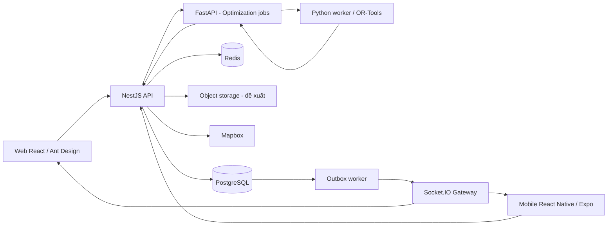

# KẾ HOẠCH XÂY DỰNG LOGISTICS / TRANSPORTATION MANAGEMENT SYSTEM

Ngày lập: 09/09/2026 · Phiên bản: 0.3 · Trạng thái: Bản nháp để phản hồi; đã chốt Mapbox và quy tắc xếp/dỡ hàng động, không xếp chồng

> Tài liệu này mô tả phương án nghiệp vụ và kỹ thuật đề xuất, chưa phải đặc tả đã được duyệt. Người dùng đã cho phép tạo file kế hoạch; chưa cho phép triển khai ứng dụng. Chỉ bắt đầu viết code, tạo database hoặc migration khi người dùng nói chính xác: **“OK, bắt đầu triển khai”**.

## 1. Hiện trạng và cách đọc tài liệu

Thư mục `E:\HocTap\Project-Logictists` trống tại thời điểm khảo sát, chưa có mã nguồn, cấu hình, module, entity hoặc database để đánh giá. Kiến trúc bên dưới là đề xuất xây dựng, không phải kiến trúc đang tồn tại.

Quy ước:

- **Đã chốt:** yêu cầu người dùng nêu rõ.
- **Đề xuất:** lựa chọn để kế hoạch đủ cụ thể và có thể phản biện; chưa tự động trở thành yêu cầu.
- **Cần chốt:** quyết định ảnh hưởng phạm vi, dữ liệu hoặc cách vận hành.
- Các quy tắc, trạng thái, schema, API, vai trò và phase dưới đây đều là **đề xuất**, trừ phần ghi rõ đã chốt.
- Các thông số tải, thời gian và tiến độ là mốc lập kế hoạch để kiểm chứng, không phải cam kết hiệu năng hoặc quy định pháp luật.

## 2. Mục tiêu và phạm vi

### 2.1. Đã chốt

1. Xây dựng TMS tập trung vận tải: đơn hàng, xe, tài xế, điều phối, tối ưu tuyến, tối ưu tải, theo dõi giao hàng và sự cố.
2. Chi nhánh là cơ sở vận hành, không mặc định là kho.
3. Phải xem xét chuyến qua nhiều ngày, ca làm việc khác nhau, vị trí thực tế của xe và tài xế.
4. Không mặc định điểm bắt đầu bằng điểm kết thúc hoặc xe phải chạy rỗng về chi nhánh gốc.
5. Không tự thêm nghiệp vụ lớn ngoài phạm vi vận tải.
6. Công nghệ cố định theo mục 3; lựa chọn NestJS/Express còn cần chốt.
7. Người dùng đã chọn Mapbox vì có key. Chưa nhận hoặc kiểm tra token; quyền API và cấu hình tích hợp sẽ được kiểm chứng khi triển khai.
8. Một xe được chở nhiều kiện/hàng cùng lúc, với điều kiện xếp và dỡ không bị vướng nhau. Không được xếp hàng chồng lên hàng khác.
9. Sau khi dỡ, phần không gian vừa trống được tái sử dụng cho hàng lấy ở các điểm tiếp theo nếu bố trí và thao tác hợp lệ.
10. Tối ưu chuyến phải tính đồng thời thứ tự lấy/giao, bố trí hàng không chồng, khả năng xếp/dỡ và tái sử dụng không gian theo từng bước. Không chỉ tối ưu route rồi bỏ qua khả năng thực hiện việc xếp/dỡ.

### 2.2. Giả định làm việc cần phản hồi

| Mã | Đề xuất cho bản đầu | Ảnh hưởng nếu thay đổi |
|---|---|---|
| A01 | Một công ty vận tải, nhiều chi nhánh | Nhiều công ty độc lập cần mô hình tenant và cách ly dữ liệu bổ sung |
| A02 | Chở hàng thuê cho nhiều khách, có thể ghép đơn | Tự vận chuyển hàng cần xác định lại doanh thu và vai trò khách hàng |
| A03 | Ưu tiên xe và tài xế do công ty quản lý | Thuê ngoài cần nghiệp vụ nhà vận tải, nhận thầu và đối soát riêng |
| A04 | Một đơn có một điểm lấy và một điểm giao trong bản đầu | Nhiều điểm cần phân bổ hàng theo từng quan hệ lấy–giao |
| A05 | Điều phối viên duyệt kế hoạch trước khi phát hành | Tự động phát hành cần chính sách quyền hạn, ngưỡng tin cậy và khôi phục |
| A06 | Bản đầu không chủ động chia một kiện hoặc một đơn qua nhiều xe | Chia đơn cần quản lý phần hàng và chuỗi bàn giao trước khi triển khai |
| A07 | GPS điện thoại tài xế là nguồn đầu tiên | GPS thiết bị xe cần tích hợp nhà cung cấp và cơ chế chọn nguồn |
| A08 | Giao diện tiếng Việt; múi giờ vận hành ban đầu Asia/Ho_Chi_Minh | Hoạt động đa quốc gia cần lịch, múi giờ và chính sách theo khu vực |
| A09 | Hàng thông thường trước; hàng nguy hiểm/lạnh cần chốt riêng | Không được tuyên bố đủ điều kiện chở hàng đặc thù chỉ bằng một cờ dữ liệu |

**Chưa biết:** đồ án hay vận hành thật; quy mô; đội phát triển; ngân sách bản đồ/hạ tầng; thời hạn; Android/iOS ưu tiên. Các điểm này quyết định độ sâu từng phase.

### 2.3. Ranh giới phạm vi

Trong kế hoạch: quản lý vận chuyển và tình trạng phần hàng đang được vận chuyển; điểm nghỉ, bàn giao và chuyển tải phục vụ chuyến; chi phí vận tải và kết quả giao nhận.

Không đưa vào kế hoạch triển khai mặc định: tồn kho, vị trí kệ, nhập/xuất kho WMS, mua hàng, ERP, kế toán tổng hợp, tính lương đầy đủ, sàn giao dịch vận tải, thủ tục hải quan. Nếu có nhu cầu sẽ bổ sung qua quyết định phạm vi.

## 3. Stack và các quyết định kỹ thuật

| Lớp | Công nghệ đã chốt | Phương án cụ thể đề xuất |
|---|---|---|
| Web | React + TypeScript, Ant Design | SPA phục vụ quản trị và điều phối; bảng dữ liệu, bộ lọc, biểu mẫu, bản đồ |
| Bản đồ | Mapbox — đã chốt | Dùng Mapbox cho bản đồ và các API địa lý phù hợp; lớp adapter cho geocoding, matrix và directions |
| Backend | Node.js + NestJS/Express | Chọn NestJS, có thể sử dụng Express adapter; không duy trì hai backend nghiệp vụ song song |
| Database | PostgreSQL | Nguồn dữ liệu nghiệp vụ chính; transaction, khóa và ràng buộc dữ liệu |
| Cache và tác vụ | Redis | Cache có thời hạn, điều phối tác vụ nền và phân phối sự kiện realtime |
| Realtime | Socket.IO | Cập nhật bản đồ, trạng thái chuyến, cảnh báo và tiến độ tối ưu |
| Optimization | Python + FastAPI + Google OR-Tools | Dịch vụ riêng nhận snapshot và trả phương án; worker chạy solver ngoài HTTP request |
| Mobile | React Native + Expo | Ứng dụng tài xế: chuyến được giao, thao tác tại điểm dừng, GPS, POD và offline |

NestJS được đề xuất để tổ chức nhiều module và phân quyền nhất quán. Express thuần vẫn nằm trong lựa chọn của người dùng, nhưng cần tự thiết lập nhiều quy ước hơn. Chưa khóa phiên bản thư viện; chọn bộ phiên bản tương thích ở phase chuẩn bị triển khai.

**Thành phần phụ trợ đề xuất, chưa chốt nhà cung cấp:** lưu tệp POD bằng object storage; nơi lưu an toàn dữ liệu offline trên mobile; dịch vụ push notification; hệ thống log/metrics; cơ chế queue dùng Redis. Đây là hạ tầng phục vụ yêu cầu hiện có, không phải module kinh doanh mới. ORM và công cụ build cũng chưa chốt.

## 4. Kiến trúc tổng thể

Đề xuất backend nghiệp vụ theo mô hình một ứng dụng chia module; tách optimization vì có runtime Python và tải CPU riêng. Chưa tách từng module thành microservice.

### 4.1. Trách nhiệm và quyền sở hữu dữ liệu

- Backend Node.js xác thực người dùng, kiểm tra nghiệp vụ, ghi dữ liệu và quyết định phát hành kế hoạch.
- Optimization nhận snapshot bất biến; không trực tiếp sửa bảng Order/Trip hoặc tự điều xe.
- PostgreSQL giữ kế hoạch, phân công, GPS được lưu, POD, lịch sử và trạng thái job cần phục hồi.
- Redis không là nơi duy nhất lưu trạng thái chuyến hoặc bằng chứng đã giao.
- Web và mobile gửi lệnh có phiên bản/idempotency key; không tự đặt trạng thái cuối cùng mà bỏ qua kiểm tra backend.
- Ghi thay đổi nghiệp vụ và outbox trong cùng transaction. Worker phát sự kiện sau commit; consumer chấp nhận sự kiện lặp và chống xử lý trùng.
- Đề xuất giao tiếp job Node–Python bằng HTTP có job ID ổn định; chọn cơ chế queue Python nội bộ sau. Không mặc định các thư viện queue Node và Python tương thích trực tiếp.

### 4.2. Luồng điều phối chính

1. Nhập và xác nhận đơn, địa chỉ, hàng, thời gian.
2. Chọn tập đơn, khoảng thời gian lập kế hoạch và đội xe/tài xế hợp lệ.
3. Tạo snapshot gồm phiên bản đơn, lịch xe/tài xế, vị trí, policy và dữ liệu hành trình.
4. Gửi job tối ưu; UI nhận tiến độ và có thể rời trang rồi xem lại.
5. Nhận phương án cùng đơn chưa xếp được, lý do và các cảnh báo.
6. Điều phối viên xem/sửa; mọi sửa đổi đều phải chạy kiểm tra khả thi.
7. Backend kiểm tra lại dữ liệu mới nhất và đặt chỗ xe/tài xế bằng transaction.
8. Phát hành kế hoạch; tài xế nhận và xác nhận theo quy trình đã chốt.
9. Thu thập thực thi, GPS, sự cố, POD; cập nhật ETA và đề xuất thay đổi phần hành trình còn lại.
10. Hoàn tất vận chuyển, xác nhận phần hàng còn lại và tổng hợp chi phí.

## 5. Vai trò và quyền hạn đề xuất

| Vai trò | Phạm vi chính |
|---|---|
| Quản trị | Người dùng, vai trò, cấu hình vận hành, phạm vi chi nhánh |
| Quản lý vận tải | Xem toàn bộ hoạt động được phân quyền, duyệt ngoại lệ và chính sách chi phí |
| Điều phối viên | Tiếp nhận đơn, lập chuyến, tối ưu, điều chỉnh kế hoạch, xử lý sự cố |
| Nhân viên tiếp nhận | Tạo/sửa thông tin đơn trong phạm vi trạng thái cho phép |
| Tài xế | Xem chuyến được giao, nhận chuyến, cập nhật thực hiện, GPS, POD và sự cố |
| Nhân viên chi phí | Nhập và xác nhận chi phí; không mặc định có quyền đổi route |

Cổng khách hàng chưa thuộc bản đầu mặc định. Cần chốt ai được xem dữ liệu liên chi nhánh và ai được điều xe/tài xế thuộc chi nhánh khác. Kiểm tra quyền tại API và kênh Socket.IO, không chỉ ẩn nút trên UI.

## 6. Đặc tả nghiệp vụ đề xuất

### 6.1. Đơn hàng

- Có mã đơn, khách hàng, người gửi/nhận và thông tin liên hệ.
- Bản đầu đề xuất một pickup và một delivery; mỗi địa chỉ lưu bản chụp thông tin, tọa độ và trạng thái xác minh.
- Mỗi dòng hàng lưu mô tả, số kiện, loại đóng gói, khối lượng, kích thước, hướng đặt và yêu cầu xử lý.
- Phân biệt thông tin khách khai báo với thông tin đã kiểm tra; thay đổi dữ liệu hàng sau điều phối phải kiểm tra lại tải.
- Pickup/delivery có cửa sổ thời gian, thời gian phục vụ dự kiến và deadline nếu khác cửa sổ nhận hàng.
- Phải chốt deadline áp dụng cho lúc đến hay lúc hoàn tất bốc/dỡ. Đề xuất dùng thời điểm hoàn tất giao hàng; UI diễn đạt rõ.
- Trạng thái dự kiến: nháp → đã xác nhận → đã phân công → đang vận chuyển → hoàn tất. Giao một phần, giao thất bại và sự cố được ghi theo phần hàng/lần giao để tránh mất thông tin.
- Hủy đơn trước pickup được xét theo trạng thái và quyền hạn. Sau pickup cần phương án trả hàng/chuyển giao; không chỉ đổi sang “đã hủy”.
- Sửa đơn đã phân công tạo phiên bản mới; nếu ảnh hưởng tải, điểm dừng hoặc thời gian thì cần cập nhật kế hoạch liên quan.

**Cần chốt:** nhiều điểm lấy/giao; ai xác nhận dữ liệu; ưu tiên; đơn vị đo; COD có nằm trong scope không; quyền hủy và phí hủy.

### 6.2. Shipment, gom đơn và phần hàng

- Order là yêu cầu của khách; Trip là kế hoạch vận hành của xe. Không dùng hai khái niệm thay thế nhau.
- Đề xuất chưa bắt buộc tạo Shipment trong bản đầu: dùng phân bổ hàng từ đơn vào chuyến.
- Nếu cần chứng từ vận chuyển/gom hàng độc lập, Shipment sẽ là nhóm phần hàng có vòng đời riêng; phải chốt trước khi thêm entity.
- Một Trip có thể chở nhiều Order nếu tương thích hàng, tải và thời gian.
- Đề xuất bản đầu phân công nguyên đơn, nhưng ghi nhận giao thiếu thực tế theo kiện/số lượng; phần chưa giao vẫn có trạng thái và nơi giữ hàng.
- Chia đơn chủ động, chuyển tải giữa xe và nhiều chặng được triển khai sau khi có định danh phần hàng và bàn giao.
- Không chia một kiện vật lý bằng cách giảm khối lượng trong dữ liệu để solver tìm được lời giải.

**Cần chốt:** đơn có được chia; kiện có định danh riêng; giao thiếu có được khách chấp nhận; đơn vị quản lý tối thiểu là kiện, pallet hay số lượng hàng.

### 6.3. Chi nhánh và vị trí

- Chi nhánh có tên, địa chỉ, tọa độ, giờ hoạt động và phạm vi điều phối.
- Home Branch là nơi quản lý xe/tài xế; Current Branch chỉ có giá trị khi thực tế đang ở chi nhánh.
- Current Location là vị trí có nguồn và thời điểm; khi xe đang trên đường không ép gán vào một chi nhánh.
- Điều xe/tài xế liên chi nhánh phải xét quyền, lịch và chi phí di chuyển đến nơi nhận việc.
- Điểm bắt đầu/kết thúc của Trip độc lập với Home Branch.
- Di chuyển đến điểm lấy hàng và di chuyển sau điểm giao cuối có thể có thời gian/chi phí, phải được tính vào lịch tài nguyên.

### 6.4. Xe tải

- Hồ sơ: biển số, loại xe, Home Branch, trạng thái, khối lượng bản thân, tải hàng cho phép và cấu hình thùng/cửa.
- Phân biệt tải hàng tối đa với tổng khối lượng xe có hàng. Điều kiện khai thác theo tuyến cần được xác nhận từ nguồn phù hợp trước vận hành.
- Lưu kích thước trong lòng thùng và kích thước thông thủy từng cửa, không dùng kích thước ngoài xe.
- Lưu yêu cầu bằng lái, tính năng đặc biệt, lịch bảo trì và thời gian không thể nhận chuyến.
- Xe khả dụng phải không trùng lịch và có thể đến điểm bắt đầu đúng giờ, không chỉ có status “rảnh”.
- Không gắn tài xế cố định làm nguồn duy nhất; phân công theo thời gian trong từng Trip.

### 6.5. Xếp/dỡ nhiều hàng và tái sử dụng không gian — đã chốt nghiệp vụ

- Một xe có thể chở nhiều kiện/hàng đồng thời; không ép một xe chỉ được nhận một kiện hoặc một đơn. Việc ghép đơn của nhiều khách vẫn cần xét tương thích và các điều kiện đơn liên quan.
- Không xếp chồng: không đặt kiện này lên kiện khác. Không cho một cờ `stackable` của kiện tự mở lại khả năng xếp chồng.
- Các kiện không được chiếm cùng không gian hoặc vượt thùng. Mỗi kiện phải có đường đưa vào/lấy ra qua cửa phù hợp mà không va chạm với hàng còn trên xe.
- Mỗi lần dỡ giải phóng đúng vùng kiện đó chiếm. Vùng trống được dùng cho lần pickup sau nếu hàng mới vừa vùng trống, lọt cửa, có đường thao tác và không chặn các lần giao tiếp theo.
- Không cộng vùng trống rời rạc thành một ô liên tục giả. Không sử dụng chỗ của hàng chưa dỡ; không tự dịch chuyển các kiện còn lại trong mô hình chỉ để tạo chỗ trống.
- Kế hoạch phải xét trạng thái hàng trước/sau từng thao tác, không chỉ trước/sau cả Trip. Khi một stop vừa giao vừa lấy, thứ tự thao tác phải được lập rõ và kiểm tra.

Kiểm tra bắt buộc cho phương án tối ưu được coi là khả thi:

1. Dữ liệu kiện/thùng/cửa, đơn vị, hướng xoay và dung sai đầy đủ.
2. Tương thích hàng–xe và tải trọng hợp lệ sau từng thao tác.
3. Bố trí không chồng, không giao nhau, nằm trong giới hạn thùng.
4. Kiện đi qua cửa và toàn bộ đường thao tác không bị hàng khác cản, kể cả khoảng cần để xoay nếu cho phép.
5. Có thể dỡ đúng kiện tại điểm cần giao; không dựa vào việc tạm dỡ/xê dịch hàng khác chưa được quy định.
6. Cập nhật chính xác vùng trống sau dỡ và bố trí hàng mới tại pickup tiếp theo.
7. Bố trí mới vẫn bảo đảm thực hiện được các thao tác tương lai trong route.

Tổng thể tích nhỏ hơn thể tích thùng **không chứng minh** xếp vừa hoặc dỡ được. Chiều cao trống phía trên một kiện không là chỗ đặt thêm kiện vì đã cấm xếp chồng.

**Thay đổi so với v0.2:** bỏ phương án chỉ kiểm tra tải/thể tích/kiện riêng lẻ rồi dùng xác nhận thủ công thay thế kiểm tra bố trí trong optimizer. Tối ưu chuyến phải bao gồm các kiểm tra trên ngay khi bàn giao năng lực này; xác nhận xếp thực tế chỉ bổ sung bằng chứng, không hợp thức hóa phương án solver chưa kiểm tra.

**Thiết kế đề xuất:** dùng bố trí mặt sàn một lớp kèm chiều cao từng kiện, vị trí/hướng cửa và kiểm tra đường thao tác. Chi tiết hình dạng kiện, pallet, hướng xoay, khoảng hở thao tác, thiết bị bốc/dỡ, chướng ngại cố định và mô hình ổn định tải/trọng tâm còn cần chốt. Không tự giả định đủ diện tích sàn là đủ thao tác.

### 6.6. Tài xế và ca làm việc

- Hồ sơ tài xế tách khỏi tài khoản đăng nhập; có bằng lái, hạn bằng, Home Branch, vị trí và điều kiện nhận việc.
- Mỗi tài xế có lịch riêng: ca, nghỉ phép, ngoại lệ, được chạy đêm/đường dài hay không.
- Theo dõi riêng thời gian lái, thời gian làm việc và thời gian nghỉ; bốc/dỡ không tự động tính là nghỉ.
- Cấu hình giới hạn lái liên tục, tổng thời gian lái/làm việc và nghỉ theo policy có ngày hiệu lực.
- Không đặt con số pháp lý mặc định trong tài liệu này; cần xác nhận địa bàn và quy định áp dụng trước khi duyệt policy.
- Chuyến qua ngày không tự reset tổng giờ lái hoặc thời gian nghỉ vào 00:00.
- Tăng ca phải có quyền phê duyệt và không được ghi đè giới hạn an toàn/pháp lý áp dụng.
- Khi mất dữ liệu thực tế, hiển thị thiếu bằng chứng về giờ làm; không tự coi tài xế đã nghỉ đủ.

### 6.7. Trip, Journey và phân công

- **Trip đề xuất:** một kế hoạch di chuyển có thứ tự điểm dừng, có thể nhiều pickup/delivery và kéo dài nhiều ngày.
- Bản đầu mỗi Trip dùng một xe; đổi xe được mô hình hóa thành phần hành trình tiếp nối và bàn giao hàng, tránh sửa đè xe cũ.
- **Journey đề xuất:** nhóm nhiều Trip phục vụ cùng một hành trình vận hành khi cần quản lý liên tục qua các chặng; không bắt buộc chỉ vì qua đêm.
- Mỗi stop có loại, địa điểm, planned/actual arrival, service start, departure và kết quả xử lý.
- Phân công tài xế tách thành các khoảng thời gian hoặc đoạn stop; hỗ trợ lịch sử bàn giao và khả năng thêm tài xế phụ về sau.
- Nghỉ giữa chuyến và qua đêm là các hoạt động có thời lượng, địa điểm và chi phí khi cần; không xóa khỏi timeline.
- Phải lưu riêng vị trí dự kiến cuối kế hoạch và vị trí thực tế mới nhất của cả xe lẫn tài xế.

**Cần chốt:** một Trip có đổi xe không; Journey có ý nghĩa vận hành riêng không; hai tài xế có cùng đi không; địa điểm đổi tài xế; cách tài xế đến/về sau bàn giao.

### 6.8. Điểm kết thúc, backhaul và cân bằng đội xe

- Chính sách điểm cuối có thể là địa điểm cố định, tập chi nhánh cho phép hoặc kết thúc mở; áp dụng riêng cho xe và tài xế.
- Không coi việc về Home Branch là miễn phí hoặc tự động phát sinh ngoài lịch.
- Đề xuất hàng chiều về lấy từ tập đơn đã được phép điều phối trong hệ thống; chưa bổ sung sàn tìm hàng bên ngoài.
- Đánh giá ghép chiều về dựa trên quãng đường thêm, thời gian, tải còn trống, khả năng xếp và lịch tài xế.
- Có thể nối sang vùng khác nếu policy cho phép và không phá vỡ cam kết tiếp theo.
- Fleet rebalancing tạo đề xuất điều chuyển có chi phí, lý do và người duyệt; không âm thầm tạo chuyến rỗng.

### 6.9. Điều phối và thay đổi kế hoạch

- Điều phối thủ công phải hoạt động được trước khi có optimizer.
- Optimizer tạo phương án nháp; không tự thay đổi chuyến đã phát hành.
- Kéo một đơn sang xe khác phải kiểm tra cả xe nguồn và xe đích, hàng đã lấy, lịch và thứ tự giao.
- Phân biệt “kiểm tra tính hợp lệ” với “tối ưu lại”: bản chỉnh thủ công luôn được kiểm tra; chạy tối ưu lại theo lựa chọn.
- Có thể khóa xe, tài xế, đơn hoặc đoạn tuyến trong lần tối ưu tiếp theo.
- Đơn đã nằm trên xe chỉ được chuyển vật lý qua quy trình bàn giao có người xác nhận.
- Thay đổi khi đang chạy chỉ tác động phần chưa thực hiện; lưu phiên bản và thông báo tài xế nhận kế hoạch mới.
- Cần quy định khi tài xế chưa nhận bản mới: bản đang có hiệu lực, phần thao tác được phép và cách điều phối liên hệ.

### 6.10. Tracking và ETA

- GPS lưu tài nguyên, nguồn, thời điểm đo, thời điểm nhận, độ chính xác, tốc độ/hướng nếu có và số thứ tự thiết bị.
- Đề xuất ban đầu gửi mỗi 15–30 giây khi đang chạy và giảm tần suất khi đứng yên; kiểm chứng trên thiết bị thật trước khi chốt.
- Đánh dấu vị trí cũ/mất tín hiệu; sự kiện đến muộn không ghi đè vị trí mới hơn.
- ETA tính cả hành trình còn lại, traffic nếu có, thời gian phục vụ, chờ cửa sổ và nghỉ dự kiến.
- Phát hiện lệch tuyến/dừng lâu bằng ngưỡng cấu hình, không kết luận sự cố chỉ từ một mẫu GPS.
- Mobile lưu đệm khi mất mạng và gửi bù; không coi điện thoại không phát GPS là xe chắc chắn đứng yên.
- GPS tài xế không luôn đại diện GPS xe: chỉ gắn vị trí xe trong khoảng phân công phù hợp và phải giữ thông tin nguồn.

Tracking nền cần quyền và cấu hình ứng dụng; phải thử nghiệm bằng development build và thiết bị thật. Không hứa GPS liên tục khi app bị hệ điều hành dừng hoặc bị người dùng đóng. Tham khảo [Expo Location](https://docs.expo.dev/versions/latest/sdk/location/).

### 6.11. POD và giao nhận

- Mỗi lần giao có kết quả: thành công, một phần hoặc thất bại; lưu người nhận, thời gian và phần hàng liên quan.
- Ảnh hàng/biên nhận, chữ ký, GPS và ghi chú áp dụng theo policy, không mặc định tất cả đều bắt buộc.
- Tệp upload có trạng thái riêng; khi offline, UI phải phân biệt lưu trên máy với server đã xác nhận.
- Thiếu bằng chứng bắt buộc thì chưa hoàn tất xác nhận POD; có luồng ngoại lệ được duyệt và ghi lý do.
- Chữ ký/ảnh không ghi đè âm thầm; sửa sai bằng bản bổ sung có lịch sử.
- Giao thất bại phải có lý do và quyết định: giao lại, đổi điểm được duyệt, giữ trên xe, bàn giao hoặc trả hàng.
- Chỉ hoàn tất Order khi phần hàng cần giao đã được giải quyết theo policy, không dựa duy nhất vào việc Trip kết thúc.

### 6.12. Giao trễ và sự cố

- **Nguy cơ trễ:** ETA của mốc cam kết vượt deadline hoặc ngưỡng cảnh báo đã cấu hình.
- **Đã trễ:** mốc thực tế vượt deadline; hoặc đã qua deadline mà mốc vẫn chưa hoàn thành.
- Lưu riêng cảnh báo dự báo và vi phạm thực tế để tránh coi dự báo là kết quả cuối cùng.
- Sự cố có loại, mức độ, nơi/thời gian, tài nguyên/đơn bị ảnh hưởng, người xử lý và bằng chứng.
- Đề xuất thông báo điều phối trước; kênh và điều kiện thông báo khách cần chốt.
- Tối ưu lại, đổi thứ tự giao hoặc chuyển hàng đều phải kiểm tra cam kết còn lại; không tự bỏ đơn ít ưu tiên mà không thông báo.

| Tình huống | Xử lý đề xuất |
|---|---|
| Xe hỏng/tai nạn | Dừng phân công mới; ghi tình trạng xe/hàng; điều phối quyết định cứu hộ, chờ hoặc chuyển tải |
| Tài xế không tiếp tục | Đánh giá người thay thế, thời gian đến điểm bàn giao và lịch hợp lệ |
| Tắc/đóng đường | Cập nhật dữ liệu tuyến, ETA; đề xuất đổi tuyến phần chưa đi |
| Pickup trễ | Ghi thời gian chờ, cập nhật khả năng giữ các cam kết tiếp theo |
| Khách vắng/từ chối | Ghi lần giao thất bại, phần hàng còn trên xe và hướng xử lý |
| Hàng hỏng/thiếu | Ghi số lượng và bằng chứng; không tự ghi đủ số lượng đã giao |
| Hàng không vừa | Ghi số đo thực tế; kiểm tra lại xe khác hoặc tách phần hàng nếu policy cho phép |

### 6.13. Chi phí và hiệu quả

- Tách dự toán, chi phí thực tế và khoản đã xác nhận.
- Nhóm chi phí: nhiên liệu, cầu đường, thời gian tài xế, tăng ca, ca đêm, lưu trú, phát sinh, chuyển tải và chạy rỗng.
- Mỗi khoản có nguồn, đơn vị, thời điểm, chứng từ nếu cần và quy tắc phân bổ.
- Penalty trong optimizer là trọng số ra quyết định; không mặc định bằng khoản phạt tài chính phải trả khách.
- Giá cước/doanh thu cần chốt nguồn trước khi báo cáo lợi nhuận. Khi chưa có doanh thu, chỉ báo cáo chi phí.
- Phân bổ chi phí chung theo phương pháp đã chọn như kg-km, thể tích-km hoặc quy tắc hợp đồng; tổng phân bổ phải khớp chi phí gốc.
- Không tính hai lần lương/phụ cấp đã nằm trong đơn giá km và lại nhập riêng.

## 7. Danh mục business rule để phản hồi

Các rule BR23–BR26 ghi nhận yêu cầu người dùng đã chốt về xếp/dỡ và không gian động. Các rule còn lại giữ trạng thái đề xuất, trừ nội dung đã được xác nhận ở mục 2.1.

| Mã | Quy tắc |
|---|---|
| BR01 | Đơn cần dữ liệu địa điểm, hàng và thời gian hợp lệ trước khi được đưa vào optimizer |
| BR02 | Khối lượng/kích thước/số lượng phải có đơn vị rõ ràng và hợp lệ; “chưa biết” khác 0 |
| BR03 | Pickup của một phần hàng phải xảy ra trước delivery của phần hàng đó |
| BR04 | Tải trên xe được kiểm tra sau từng lần lấy/giao, không chỉ cộng mọi đơn của cả Trip |
| BR05 | Tổng thể tích chỉ là bộ lọc sơ bộ, không là chứng nhận xếp vừa |
| BR06 | Một tài nguyên không được có hai phân công hoạt động chồng thời gian |
| BR07 | Hai phân công không chồng giờ vẫn phải đủ thời gian di chuyển giữa hai địa điểm |
| BR08 | Home Branch không tự quyết định vị trí hiện tại hoặc điểm kết thúc |
| BR09 | Ca và ngày nghỉ được xét theo từng tài xế; qua ngày không tự xóa giờ đã làm |
| BR10 | Không bỏ qua ràng buộc an toàn/pháp lý bằng thao tác kéo thả hoặc trọng số optimizer |
| BR11 | Kế hoạch được phát hành chỉ khi còn hợp lệ với phiên bản dữ liệu hiện tại |
| BR12 | Hàng đã pickup không được chuyển xe chỉ bằng đổi khóa ngoại |
| BR13 | Giao một phần phải bảo toàn số lượng và xác định nơi giữ phần còn lại |
| BR14 | Hủy sau pickup phải có phương án xử lý hàng |
| BR15 | Kết thúc Trip không đồng nghĩa mọi Order đã hoàn tất |
| BR16 | Lệnh gửi lại do retry không được tạo giao hàng, chi phí hoặc sự cố trùng |
| BR17 | Sự kiện GPS cũ không ghi đè vị trí mới; thiết bị offline phải được hiển thị rõ |
| BR18 | Cảnh báo có nguy cơ trễ và giao trễ thực tế là hai dữ kiện khác nhau |
| BR19 | Optimizer phải trả đơn chưa xếp được hoặc trạng thái thất bại rõ ràng |
| BR20 | Thay đổi kế hoạch đang chạy giữ nguyên lịch sử và phần đã hoàn thành |
| BR21 | Chi phí optimizer và sổ chi phí thực tế được phân biệt |
| BR22 | Quyền truy cập theo vai trò/phạm vi được áp dụng cả API, tệp POD và realtime |
| BR23 | Một xe được chở nhiều kiện/hàng; không xếp chồng hoặc để các kiện giao nhau |
| BR24 | Mỗi thao tác lấy vào/dỡ ra phải có đường qua cửa hợp lệ, không bị hàng còn trên xe cản |
| BR25 | Sau dỡ, cập nhật vùng trống thực tế và cho phép tái sử dụng ở pickup tiếp theo nếu hình học, thao tác và tải còn hợp lệ |
| BR26 | Tối ưu chuyến phải xét đồng thời route và bố trí thay đổi theo từng thao tác; không công nhận nghiệm chỉ đạt tổng tải/thể tích |

## 8. Domain model và schema mức thiết kế

### 8.1. Quan hệ cốt lõi

- Customer → nhiều Order → nhiều OrderItem/Package.
- Order → các OrderStop; MVP giới hạn một pickup và một delivery bằng kiểm tra nghiệp vụ.
- Trip → nhiều TripStop có thứ tự; mỗi TripStop → các StopTask lấy/giao phần hàng cụ thể.
- Allocation nối phần hàng của Order với Trip, pickup task và delivery task.
- Vehicle → nhiều reservation theo thời gian; Trip có một xe ở phạm vi MVP.
- Driver → nhiều DriverAssignment gắn Trip và đoạn/thời gian phụ trách.
- Journey → nhiều Trip nếu được duyệt bổ sung.
- DeliveryAttempt → nhiều kết quả phần hàng và POD; không gắn một ảnh POD duy nhất cho toàn bộ Order.

### 8.2. Bảng dự kiến

| Nhóm / bảng | Trường tiêu biểu | Ghi chú |
|---|---|---|
| users, roles, user_scopes | id, role_id, branch_id, active | Tách quyền tài khoản khỏi hồ sơ nhân sự |
| branches | id, code, address, lat, lng, timezone | Cơ sở vận hành |
| customers, contacts | id, code, name, contact_details | Giới hạn dữ liệu cá nhân cần lưu |
| orders | id, code, customer_id, status, priority, version | Trạng thái tổng hợp có quy tắc |
| order_stops | id, order_id, type, address_snapshot, coordinates, window_start/end, deadline, service_duration | Không để sửa danh bạ làm thay đổi đơn cũ |
| order_items / packages | id, order_id, quantity, weight, dimensions, allowed_orientations | Không xếp chồng là rule chung; chốt mức định danh vật lý trước triển khai |
| vehicles | id, plate, home_branch_id, payload_limit, body_dimensions, status | Current state là dữ liệu suy ra/cập nhật có kiểm soát |
| vehicle_doors | id, vehicle_id, type, width, height | Một xe nhiều cửa |
| vehicle_unavailability | vehicle_id, time_range, reason | Bảo trì, hỏng, khóa vận hành |
| drivers, driver_licenses | id, home_branch_id, qualifications, validity | Không lưu bằng lái chỉ bằng chuỗi mô tả tùy ý |
| driver_shifts, driver_leave | driver_id, starts_at, ends_at, policy_id | Lịch thực tế và ngoại lệ |
| work_policies | id, effective_from, limits, jurisdiction | Cấu hình có phiên bản, cần xác nhận |
| trips | id, code, vehicle_id, status, active_plan_version, planned_start/end | Thời gian kế hoạch tách thực tế |
| trip_stops | id, trip_id, plan_version, sequence, location, type, planned_times, actual_times | Stop mới không ghi đè stop đã thực thi |
| stop_tasks | id, trip_stop_id, allocation_id, action, planned_quantity, actual_quantity | Phân biệt stop với từng việc tại stop |
| allocations | id, order_item_id, trip_id, quantity, pickup_task, delivery_task, status | Ràng buộc bảo toàn phần hàng |
| driver_assignments | id, trip_id, driver_id, role, time_range, start_stop, end_stop | Tách assignment để hỗ trợ thay người |
| resource_reservations | resource_type/id, trip_id, time_range, status | Chống đặt trùng trong phạm vi active |
| plan_revisions | id, trip_id, version, reason, author, published_at | Snapshot và lịch sử điều phối |
| driver_activity_events | driver_id, trip_id, type, occurred_at, source | Lái, làm việc khác, nghỉ; xét độ tin cậy |
| gps_events | device_id, sequence, resource_id, measured_at, received_at, coordinates, accuracy | Dữ liệu lớn, cân nhắc partition theo thời gian |
| delivery_attempts, delivery_results | stop_task_id, result, quantity, reason, recipient, occurred_at | Hỗ trợ giao lại, giao một phần |
| pod_files | attempt_id, storage_key, checksum, upload_status, metadata | Lưu metadata và tham chiếu tệp |
| incidents | id, trip_id, type, severity, status, occurred_at, resolution | Liên kết Order/xe/tài xế bị ảnh hưởng |
| cost_entries, cost_allocations | trip_id, category, amount, currency, estimated_or_actual, source | Phân bổ có thể truy vết |
| optimization_jobs, optimization_results | id, snapshot_ref/hash, status, policy_version, solver_version, result, diagnostics | Không chỉ lưu trạng thái ở Redis |
| load_plan_steps, load_placements | plan_version, stop_task_id, operation_sequence, package_ref, x, y, orientation, door_id, handling_path_ref | Đề xuất lưu bố trí và đường thao tác theo bước; vùng trống suy ra từ thùng và các kiện còn trên xe; kích thước snapshot giữ đủ chiều cao |
| outbox_events, processed_commands, audit_logs | event_id, aggregate_version, idempotency_key, actor, timestamp | Tin cậy sự kiện và lịch sử |
| journeys, cargo_transfers | journey_id, linked_trips; transfer_from/to, quantity, confirmations | Chỉ thêm khi phase tương ứng được duyệt |

Đây là schema khái niệm, chưa phải DDL. Những nhóm dùng dấu “/” cần được chuẩn hóa thành bảng cụ thể sau khi chốt cách định danh hàng và vòng đời dữ liệu.

### 8.3. Ràng buộc và tính nhất quán

- ID ổn định; mã hiển thị có uniqueness theo phạm vi được chọn; không tái sử dụng mã đã có giao dịch.
- Dùng timestamp có múi giờ cho thời điểm; lưu UTC và timezone của địa điểm/lịch. Lịch ca lặp cần giờ địa phương và ngày hiệu lực.
- Dùng đơn vị chuẩn nội bộ, ví dụ gram/millimetre/second; tiền dùng decimal hoặc đơn vị tiền nhỏ nhất, không cộng tiền bằng số thực nhị phân.
- CHECK cho số lượng/kích thước/thời gian; FK cho quan hệ; index theo mã đơn, trạng thái, chi nhánh, thời gian và tài nguyên.
- Khóa hàng/transaction khi phân bổ hàng để tổng phần phân bổ không vượt phần còn lại; CHECK đơn lẻ không đủ cho tổng nhiều bản ghi.
- Reservation dùng cơ chế ràng buộc không giao nhau hoặc transaction có khóa tài nguyên tương đương; kiểm tra tại ứng dụng đơn thuần không đủ chống race condition.
- Quy ước khoảng thời gian [bắt đầu, kết thúc); cộng thời gian chuẩn bị/di chuyển theo policy, không coi hai ca sát nhau luôn khả thi.
- `version` phục vụ optimistic concurrency; trả xung đột khi người dùng sửa trên bản cũ.
- Hạn chế xóa dữ liệu đã tham gia vận chuyển; dùng hủy/đóng hiệu lực và audit phù hợp.
- Nếu sau này hỗ trợ nhiều công ty độc lập, phải thiết kế lại phạm vi unique/FK/query và quyền cách ly trước rollout; không cho rằng thêm một cột tenant_id là đủ.

## 9. Vòng đời và lệnh nghiệp vụ

### 9.1. Trip đề xuất

Nháp → đã lập kế hoạch → đã phát hành → đang thực hiện → hoàn tất.

- Hủy chỉ hợp lệ theo điều kiện về thực hiện và phần hàng.
- Tạm dừng/sự cố nên là trạng thái vận hành có lý do, không làm mất mốc vòng đời.
- Tài xế chấp nhận/từ chối là trạng thái phân công riêng; tránh tạo hàng chục trạng thái Trip kết hợp.
- Lệnh bắt đầu yêu cầu xe/tài xế hợp lệ và phiên bản kế hoạch còn hiệu lực.
- Hoàn tất yêu cầu giải quyết các stop và phần hàng còn lại, hoặc quy trình đóng chuyến có ngoại lệ được duyệt.

### 9.2. API định hướng

Đề xuất REST cho lệnh và truy vấn; Socket.IO cho thông báo thay đổi. Đây là danh mục hợp đồng, chưa triển khai endpoint.

| Nhóm | Thao tác |
|---|---|
| Orders | Tạo nháp, xác nhận, sửa với version, yêu cầu hủy, xem lịch sử |
| Resources | Hồ sơ xe/tài xế, lịch, availability, vị trí có timestamp |
| Dispatch | Tạo Trip, phân bổ đơn, sắp stop, validate, publish, revise |
| Optimization | Tạo job, xem trạng thái/kết quả, hủy, tạo phương án từ kết quả |
| Execution | Nhận phân công, bắt đầu, đến stop, xác nhận pickup/delivery, nghỉ, kết thúc |
| Tracking | Nhận GPS theo batch, lấy vị trí mới nhất, xem lịch sử |
| POD | Khởi tạo upload, xác nhận tệp, nộp bằng chứng, bổ sung/correction |
| Incidents / Costs | Tạo và xử lý sự cố; nhập, duyệt và phân bổ chi phí |

Lệnh quan trọng có command ID, người thao tác, thời điểm, version và kết quả lưu để retry an toàn. API cần phân biệt lỗi dữ liệu, vi phạm nghiệp vụ, xung đột phiên bản và dịch vụ phụ thuộc không sẵn sàng.

Socket.IO giữ thứ tự sự kiện nhưng mặc định không bảo đảm mọi sự kiện sẽ được giao lại sau mất kết nối. Vì vậy cần event ID, cursor hoặc tải lại snapshot khi reconnect; không dùng socket làm nguồn dữ liệu duy nhất. Tham khảo [Socket.IO delivery guarantees](https://socket.io/docs/v4/delivery-guarantees/).

## 10. Thiết kế Optimization Engine

### 10.1. Bài toán và ranh giới

Đề xuất bắt đầu bằng bài toán lấy–giao nhiều xe, cửa sổ thời gian, tải trọng và tập xe đủ điều kiện, **bắt buộc tích hợp xếp/dỡ không chồng và tái sử dụng không gian theo từng thao tác**. Mở rộng dần sang nhiều ngày, ca/nghỉ phức tạp, thay tài xế và điều phối động khi đang chạy; không trì hoãn ràng buộc xếp/dỡ đã chốt sang phase sau.

OR-Tools hỗ trợ các bài toán routing với ràng buộc tải và thời gian, nhưng không bảo đảm tìm được tối ưu toàn cục trong thời hạn cho mọi quy mô. Kết quả phải ghi giới hạn chạy và chất lượng phương án; không gắn nhãn “tối ưu tuyệt đối”. Tham khảo [OR-Tools Vehicle Routing](https://developers.google.com/optimization/routing).

### 10.2. Dữ liệu đầu vào

- Job ID, snapshot version, thời điểm lập kế hoạch, horizon và policy version.
- Danh sách phần hàng/đơn, pickup/delivery, service time, time windows, ưu tiên và khả năng bỏ lại nếu được phép.
- Xe: vị trí bắt đầu có tuổi dữ liệu, thời gian sẵn sàng, capacity, cửa/thùng, điểm kết thúc cho phép.
- Tài xế: vị trí, bằng lái, ca/nghỉ, lịch đã cam kết, giờ lái/làm việc đã tích lũy.
- Matrix thời gian/khoảng cách cùng provider, profile, thời điểm truy vấn và trạng thái từng cặp điểm.
- Chuyến đang thực hiện, hàng đang trên xe, stop đã hoàn thành và các quyết định bị khóa.
- Kích thước/hướng từng kiện, hình học thùng/cửa, bố trí hiện tại của hàng trên xe và ràng buộc thao tác. Thiếu bố trí thực tế thì không được tự vẽ lại hàng đã xếp để tạo nghiệm giả.
- Hệ số chi phí, ngưỡng trễ mềm, thời gian chạy tối đa và các giới hạn nghiệm thử.

### 10.3. Pipeline

1. **Chuẩn hóa và xác thực:** loại lỗi dữ liệu khỏi bài toán với lý do cụ thể, không biến dữ liệu thiếu thành 0.
2. **Sàng lọc tương thích:** hàng–xe, tài xế–xe, thời gian và địa điểm có thể tiếp cận.
3. **Chuẩn bị matrix:** chia batch, giới hạn tốc độ gọi, xử lý cặp không có đường; cache theo điều kiện được provider cho phép.
4. **Tạo mô hình routing:** pickup trước delivery, capacity động, cửa sổ, service time, starts/ends riêng.
5. **Ghép và kiểm tra tài xế:** MVP có thể dùng cặp xe–tài xế đủ điều kiện làm tài nguyên ứng viên; mọi kết quả cần qua bộ kiểm tra lịch độc lập.
6. **Giải có giới hạn:** tìm nghiệm khả thi trước, cải thiện theo ngân sách thời gian; cho phép trả nghiệm đang có khi hết giờ.
7. **Kiểm tra và phối hợp bố trí:** kiểm tra giờ làm/nghỉ, khả năng đến nhận xe; mô phỏng từng thao tác xếp/dỡ không chồng, đường qua cửa, vùng trống sau dỡ và pickup mới. Kiểm tra cả khả năng dỡ các kiện còn lại về sau.
8. **Lặp có giới hạn:** loại tổ hợp không hợp lệ và giải lại; nếu hết ngân sách thì trả kết quả chưa được xác minh hoặc chưa có nghiệm, không phát hành.
9. **Đóng gói kết quả:** tuyến, ETA, tải từng đoạn, bố trí trước/sau từng thao tác, kiện/cửa/thứ tự thao tác, vùng trống được tái sử dụng, chi phí thành phần, đơn chưa xếp, cảnh báo và provenance dữ liệu.
10. **Kiểm tra trước publish:** so sánh snapshot với trạng thái mới nhất; chỉ áp dụng khi vẫn hợp lệ.

Việc ghép tài xế sau routing có thể bỏ lỡ nghiệm tốt hoặc tạo vòng lặp. Giai đoạn nâng cao cần thử mô hình phối hợp routing và scheduling, có thể dùng thêm CP-SAT trong OR-Tools; lựa chọn cuối dựa trên benchmark thay vì hứa một mô hình giải được mọi ràng buộc.

### 10.4. Hard constraints và soft constraints

| Hard constraints đề xuất | Soft constraints cần chốt trọng số |
|---|---|
| Không vượt tải; bằng lái/xe phù hợp | Tổng quãng đường và thời gian |
| Không xếp chồng, không va chạm; đường xếp/dỡ hợp lệ từng bước | Tận dụng vùng trống có thể sử dụng thực tế |
| Pickup trước delivery; bảo toàn phần hàng | Km rỗng và độ lệch tuyến để ghép đơn |
| Không trùng phân công, đủ thời gian di chuyển | Số xe sử dụng và mức tận dụng tải |
| Giới hạn lái/nghỉ bắt buộc được xác nhận | Trễ trong mức được hợp đồng cho phép |
| Hàng/xe không tương thích bị loại | Độ ưu tiên, chi phí làm thêm hợp lệ |
| Không sửa đoạn đã thực hiện hoặc khóa | Mức thay đổi so với kế hoạch đã phát hành |

Một time window có thể cứng hoặc mềm tùy cam kết; không tự mặc định cho mọi khách. Đề xuất mục tiêu theo thứ tự ưu tiên: khả thi → đáp ứng cam kết bắt buộc → giảm đơn chưa phục vụ → giảm chi phí và xáo trộn. Chưa đặt trọng số số học khi chưa có dữ liệu kinh doanh.

### 10.5. Phối hợp routing và bố trí hàng động không chồng

- Routing và bộ kiểm tra bố trí phải trao đổi kết quả: thứ tự stop ảnh hưởng chỗ trống và khả năng dỡ; bố trí không hợp lệ buộc đổi vị trí/hướng kiện, thứ tự lấy/giao hoặc phân xe rồi kiểm tra lại.
- Có thể dùng vòng lặp giới hạn hoặc mô hình phối hợp; không bắt buộc mọi ràng buộc nằm trong một solver duy nhất. Kết quả cuối phải vượt toàn bộ hard constraints đã chốt.
- Đề xuất trạng thái mỗi bước gồm kiện đang trên xe, vị trí/hướng của chúng, cửa thao tác và hình học vùng còn trống. Không xếp chồng nên tập trung bố trí một lớp, nhưng vẫn xét chiều cao và chuyển động qua cửa.
- Khi dỡ kiện A, giữ vị trí các kiện còn lại và giải phóng vùng A. Khi lấy kiện C, tìm vị trí và đường đưa C vào vùng trống có thể tiếp cận; kiểm tra C không chặn việc giao B sau đó.
- Không mặc định chỉ FIFO/LIFO cho mọi xe: khả năng tiếp cận phụ thuộc cửa và hình học. Không dùng thứ tự danh sách thay cho kiểm tra va chạm/đường thao tác.
- Không tự cho phép dỡ tạm hoặc chuyển các kiện khác để mở lối. Nếu cần nghiệp vụ đó, phải chốt quy trình, thời gian và ghi thành thao tác rõ trước khi dùng trong tối ưu.
- Khi hết thời gian chưa xác minh xếp/dỡ, trả trạng thái chưa xác minh, không publish như phương án khả thi. Không tìm được bằng heuristic chưa phải bằng chứng không thể xếp.
- Giao diện cho xem bố trí theo từng stop/thao tác, phần hàng còn trên xe, vùng vừa trống và hàng mới dùng vùng đó; tách kiểm tra kế hoạch với xác nhận thực tế.

Ví dụ nghiệm thu: xe đang chở A và B; giao A ở stop 1 → vùng A trống; lấy C ở stop 2 → có thể đặt C vào vùng đó nếu đường đưa vào hợp lệ và vẫn dỡ B được ở stop 3. Nếu C vừa chỗ nhưng chặn B, phương án phải bị loại hoặc điều chỉnh. Nếu C chỉ vừa khi đặt lên B thì phương án bị loại vì cấm xếp chồng.

### 10.6. Không tìm được lời giải

Phân biệt rõ: dữ liệu đầu vào sai; provider lỗi; bị hủy; hết thời gian chưa có nghiệm; có nghiệm một phần; có nghiệm khả thi; hoặc chứng minh bất khả thi khi solver thực sự cung cấp bằng chứng phù hợp.

Thông báo chẩn đoán đề xuất: không có xe đủ tải, không có tài xế đủ lịch, cửa xe không phù hợp, cửa sổ quá hẹp, không có đường đi, hoặc ràng buộc khóa xung đột. Khi chưa xác định nguyên nhân, ghi “chưa xác định”; không khẳng định bất khả thi chỉ từ timeout.

Cho phép người dùng thu hẹp tập đơn, thêm tài nguyên, nới ràng buộc mềm hoặc điều phối thủ công có kiểm tra. Không tự nới ràng buộc an toàn.

### 10.7. Mapbox — provider đã chốt, tích hợp cần kiểm chứng

- Mapbox đã được người dùng chọn; không còn bước so sánh để chọn provider. Kiểm chứng địa chỉ/tuyến thực tế, geocoding, matrix, traffic, quyền API, quota và chi phí theo khối lượng thử nghiệm.
- Hiển thị bản đồ, tính directions và tính matrix là các nhu cầu khác nhau; lựa chọn SDK hiển thị không tự bảo đảm đủ dữ liệu tối ưu.
- Xác minh điều kiện lưu/cache và attribution của từng API Mapbox trước triển khai; chưa chốt chính sách cache.
- Cấu hình token qua môi trường theo thành phần sử dụng; chỉ đưa token dành cho client với quyền phù hợp vào web/mobile, không đưa token bí mật của server vào bundle hoặc tài liệu. Không coi việc đã có key là bằng chứng mọi API đã sử dụng được.
- Mapbox cung cấp dữ liệu bản đồ/hành trình; Python + FastAPI + Google OR-Tools vẫn là Optimization Engine đã chốt. Không tự thay bằng Mapbox Optimization API.
- Không mặc định tuyến ô tô là tuyến hợp lệ cho tải trọng, chiều cao hoặc giờ cấm xe tải. Thiếu dữ liệu phải có cảnh báo và quy trình xác nhận tuyến.
- Matrix phải xử lý lỗi từng cặp điểm, không thay bằng quãng đường thẳng như một tuyến chắc chắn đi được.

Mapbox Matrix API trả thời gian/khoảng cách giữa các điểm, không trả hình học tuyến. Giá trị có thể khác theo chiều đi và là null khi không tìm được đường; cần kiểm tra giới hạn theo profile khi chia batch. Nguồn: [Mapbox Matrix API](https://docs.mapbox.com/api/navigation/matrix/).

## 11. Web và mobile dự kiến

### 11.1. Web React + TypeScript + Ant Design

1. Tổng quan vận hành: đơn chờ, chuyến đang chạy, cảnh báo, tài nguyên chưa sẵn sàng.
2. Đơn hàng: danh sách, nhập/sửa, chi tiết hàng/địa điểm, lịch sử và kết quả giao.
3. Xe và tài xế: hồ sơ, lịch, trạng thái có thời điểm, phân công hiện tại/dự kiến.
4. Chi nhánh: địa điểm vận hành và phạm vi quản lý.
5. Bàn điều phối: đơn chưa xếp, timeline xe/tài xế, bản đồ và phương án đang chỉnh.
6. Kết quả optimizer: so sánh phương án, nguyên nhân chưa xếp, cảnh báo và nút kiểm tra/phát hành.
7. Chi tiết Trip: stop, hàng, phân công, kế hoạch/thực tế, POD, sự cố và chi phí.
8. Theo dõi trực tiếp: tuổi GPS, ETA, lệch tuyến và trạng thái kết nối.
9. Báo cáo: đúng hạn, giao thất bại, km rỗng, sử dụng tải và chi phí.
10. Cấu hình/quyền: policy, loại xe/hàng, lý do ngoại lệ và phạm vi chi nhánh.

UI không thể hiện màu xanh “hợp lệ” nếu chưa kiểm tra đủ tầng. Bảng có phân trang/lọc phía server khi dữ liệu tăng. Các thao tác khó đảo ngược như phát hành hoặc hủy chuyến cần hiển thị tác động cụ thể.

### 11.2. Mobile React Native + Expo

- Đăng nhập, xem lịch và nhận/từ chối phân công theo quyền.
- Xem bản kế hoạch có version, danh sách stop và thông tin liên hệ cần thiết.
- Bắt đầu, đến điểm, pickup, giao hàng, nghỉ và kết thúc bằng thao tác rõ ràng.
- Chụp POD, ghi số lượng thực tế, báo sự cố, xem ETA/cảnh báo liên quan.
- Hiển thị lệnh chờ đồng bộ, tệp chưa upload và xung đột kế hoạch cần xử lý.
- Giữ dữ liệu chuyến được giao khi offline; đồng bộ có thứ tự và idempotency khi kết nối lại.
- Chốt mở ứng dụng dẫn đường ngoài hay dẫn đường trong app; chưa tự thêm turn-by-turn đầy đủ.
- Chốt phạm vi thu GPS theo ca/chuyến và thời gian lưu; không mặc định theo dõi ngoài giờ làm.

## 12. Kiểm thử và tiêu chí nghiệm thu

### 12.1. Chiến lược

- Unit test cho quy tắc thời gian, tải từng chặng, trạng thái và bảo toàn số lượng.
- Integration test với PostgreSQL thật cho transaction phân công, chống trùng và idempotency.
- Contract test Node–Python cho snapshot, version, trạng thái job và kết quả.
- End-to-end cho nhận đơn → điều phối → tài xế thực hiện → POD → hoàn tất.
- Test mobile trên thiết bị thật: nền, bị đóng, mất mạng, mất quyền GPS, tệp upload lại.
- Benchmark optimizer trên bộ dữ liệu nhỏ biết nghiệm và dữ liệu đại diện; bộ validator độc lập kiểm tra nghiệm trả về.
- Không so solver chỉ bằng số km; đo tỷ lệ phục vụ, vi phạm, chi phí, thời gian chạy và thay đổi kế hoạch.

### 12.2. Ma trận ngoại lệ bắt buộc xét

| Mã | Kịch bản | Kết quả cần đạt |
|---|---|---|
| T01 | Hai dispatcher cùng đặt một xe/tài xế | Chỉ một transaction hợp lệ; bên còn lại nhận xung đột |
| T02 | Sửa đơn trong lúc optimizer chạy | Không áp dụng kết quả cũ mà bỏ qua kiểm tra version |
| T03 | Ca 22:00–06:00, nghỉ qua nửa đêm | Lịch không reset sai ở 00:00 |
| T04 | Xe rảnh theo giờ nhưng ở xa điểm nhận | Không phân công khi không thể đến đúng giờ |
| T05 | Tải cả Trip lớn nhưng có giao trước lấy sau | Tính tải đúng từng đoạn, không loại nhầm chỉ vì tổng mọi đơn |
| T06 | Thể tích đủ nhưng kiện không qua cửa | Bị loại hoặc yêu cầu sửa dữ liệu/phương án |
| T07 | Các kiện riêng lẻ vừa nhưng không bố trí chung không chồng/không cản được | Validator chặn phương án; không dùng tổng thể tích hoặc xác nhận thủ công để bỏ qua |
| T08 | Khách nhận một phần rồi từ chối phần còn lại | Bảo toàn số lượng, ghi phần còn lại đang ở đâu |
| T09 | Hủy đơn khi hàng đã lên xe | Có quy trình giải quyết hàng và lịch sử |
| T10 | Đổi tài xế giữa đường | Đủ lịch, bằng lái, thời gian đến điểm đổi và bàn giao |
| T11 | GPS trùng, sai thứ tự, lệch giờ thiết bị | Không nhảy lùi vị trí mới nhất; giữ dấu chất lượng dữ liệu |
| T12 | Offline rồi gửi lại POD/lệnh giao | Không tạo kết quả trùng; UI biết trạng thái server |
| T13 | Xe hỏng, chuyển hàng sang xe khác | Giữ chuỗi bàn giao và tải của hai xe |
| T14 | Solver timeout, thiếu xe hoặc provider lỗi | Phân biệt lỗi, hiển thị đơn chưa xếp, không tự publish |
| T15 | Redis/Socket.IO gián đoạn | Dữ liệu nghiệp vụ còn trong PostgreSQL; client tải lại được trạng thái |
| T16 | Tài xế offline khi kế hoạch thay đổi | Phát hiện version cũ, xử lý xung đột có thông báo |
| T17 | Bằng lái hết hạn giữa khoảng phân công | Policy thời gian được kiểm tra toàn khoảng cần thiết |
| T18 | Có nghiệm nhưng thiếu nghỉ hoặc vi phạm hard constraint | Validator chặn phát hành |
| T19 | Giao đủ nhưng bằng chứng chưa upload | Không nhầm local saved với POD đã xác nhận |
| T20 | User chi nhánh A truy cập chuyến ngoài quyền | API, socket và tệp đều từ chối đúng phạm vi |
| T21 | Nhiều kiện cùng xe vừa sàn/thùng, không chồng và xếp/dỡ thông suốt | Chấp nhận; không ép mỗi xe chỉ một kiện/đơn |
| T22 | Một kiện chỉ vừa khi đặt lên kiện khác | Loại phương án dù tổng tải/thể tích còn dư |
| T23 | Giao A rồi lấy C vào vùng A, B vẫn ở trên xe | Chấp nhận nếu C vào được và vẫn dỡ B/C đúng kế hoạch; vị trí B không tự đổi |
| T24 | C vừa vùng A nhưng chắn B cần giao trước C | Loại hoặc điều chỉnh phân xe/bố trí/route rồi kiểm tra lại |
| T25 | Tổng diện tích trống đủ nhưng bị chia thành các vùng nhỏ | Không ghép giả các vùng trống để cho một kiện lớn vào |
| T26 | Cửa đủ kích thước nhưng đường đưa kiện đến chỗ trống bị chắn | Loại thao tác, không chỉ kiểm tra hình chữ nhật cửa |
| T27 | Pickup C trước khi dỡ A; hoặc một stop vừa giao A vừa lấy C | Không dùng chỗ A khi A chưa dỡ; lập và kiểm tra đúng thứ tự từng thao tác |

### 12.3. Nghiệm thu theo năng lực

- MVP phải thực hiện được một chuyến ghép nhiều đơn từ đầu đến cuối và truy vết lịch sử.
- Không có phân công trùng hoặc cấp phát phần hàng quá số lượng trong kiểm thử đồng thời.
- Kết quả tối ưu được publish phải vượt validator, gồm bố trí không chồng, đường xếp/dỡ và tái sử dụng không gian từng bước. Không dùng xác nhận thủ công thay cho kiểm tra bắt buộc này.
- Mọi đơn chưa phục vụ có trạng thái và khả năng truy lại; không bị mất khỏi màn hình khi solver trả nghiệm một phần.
- Khôi phục sau mất mạng phải không tạo giao hàng/POD/chi phí trùng.
- Các tính năng chưa hỗ trợ, như thay tài xế ở phase sớm, phải được chặn hoặc ghi rõ. Riêng kiểm tra xếp/dỡ không chồng và không gian động là tiêu chí bắt buộc để bàn giao tối ưu chuyến.

## 13. Hiệu năng, vận hành và an toàn dữ liệu

- Chốt tải mục tiêu bằng số đơn/ngày, stop/job, xe đồng thời và chu kỳ GPS trước khi cam kết SLA.
- Đề xuất bộ benchmark ban đầu: 50, 200 và 500 đơn với cấu hình xe và time window khác nhau; ghi rõ một đơn có thể sinh hai hoặc nhiều task/stop.
- Đề xuất mục tiêu thử nghiệm: API thông thường p95 dưới 1 giây, không tính upload và dịch vụ bản đồ; solver có ngân sách 30–120 giây/job tùy kích thước. Cần đo rồi duyệt lại.
- Lưu phiên bản solver, tham số, snapshot và dữ liệu matrix được phép giữ để đối chiếu kết quả; không hứa tái lập tuyệt đối nếu dữ liệu bên ngoài thay đổi.
- Giới hạn số worker solver, hủy job, timeout, retry có backoff; job lỗi không chiếm CPU vô hạn.
- Giám sát API errors, queue lag, solver duration, tỷ lệ không có nghiệm, GPS stale, upload lỗi và chi phí API bản đồ.
- Backup PostgreSQL, thử restore trước pilot; có phương án phục hồi metadata/tệp POD nhất quán.
- Secret ở cấu hình an toàn; key bản đồ giới hạn theo ứng dụng/API; không đưa server secret vào web/mobile.
- HTTPS, kiểm tra tệp, URL truy cập có hạn và audit quyền xem POD/GPS.
- Chính sách lưu GPS, POD và thông tin cá nhân cần được chốt theo nhu cầu vận hành và quy định áp dụng; chưa ấn định số ngày.
- Với GPS lưu dài hạn, đánh giá partition/retention bằng số mẫu thực tế. PostGIS là lựa chọn mở rộng PostgreSQL nếu cần truy vấn không gian, chưa bắt buộc thêm ngay.

## 14. Roadmap triển khai theo phase

**Toàn bộ phase triển khai bên dưới chỉ bắt đầu sau câu xác nhận triển khai của người dùng.** Thời lượng là ước lượng sơ bộ với giả định có năng lực backend/web, mobile, optimization và QA làm việc ổn định; chưa có đủ dữ liệu để cam kết ngày giao. Phải ước lượng lại nếu một người đảm nhiệm tất cả.

| Phase | Phạm vi và đầu ra | Điều kiện hoàn thành | Ước lượng sơ bộ |
|---|---|---|---|
| P0 — Chốt phạm vi | Phản hồi tài liệu; chốt mô hình công ty, Order/Trip, dữ liệu hàng, lịch, MVP và kiểm chứng tích hợp Mapbox | Danh sách quyết định quan trọng được duyệt | 1–2 tuần |
| P1 — Nền tảng và điều phối thủ công | Auth/quyền, chi nhánh, khách, xe, tài xế, ca; Order, Trip, phân công, validate/publish, audit | Tạo và phát hành chuyến ghép đơn, chống đặt trùng | 3–5 tuần |
| P2 — Thực thi vận chuyển | Mobile, stop actions, POD, GPS, offline cơ bản, sự cố/giao thiếu có kiểm soát | Chạy end-to-end bằng thiết bị thật, dữ liệu không trùng khi retry | 3–5 tuần |
| P3 — Tối ưu MVP | FastAPI/worker, matrix, pickup–delivery, tải/time windows; phối hợp bố trí không chồng, đường xếp/dỡ và tái sử dụng không gian; job UI/validator | Đạt T21–T27 cùng kiểm tra routing/lịch; chỉ publish nghiệm hợp lệ | Cần ước lượng lại sau thử nghiệm hình học và chốt thao tác; mốc 3–5 tuần cũ không còn áp dụng |
| P4 — Vận tải nâng cao | Nhiều ngày, nghỉ/ca phức tạp, thay tài xế nếu duyệt, chuyển tải, backhaul, cập nhật phần tuyến còn lại | Đạt các kịch bản liên ngày/bàn giao và không phá cam kết hiện hành | 4–7 tuần |
| P5 — Hiệu năng bố trí và kinh tế vận tải | Cải thiện hiệu năng/chất lượng bố trí đã có ở P3; chi phí thực tế/phân bổ và báo cáo | Giữ các rule không chồng/không cản/không gian động; số liệu chi phí truy vết được | Cần ước lượng lại do phạm vi bố trí đã chuyển vào P3 |
| P6 — Pilot và củng cố | Benchmark thực tế, quan sát vận hành, backup/restore, xử lý lỗi và tài liệu sử dụng | UAT đạt, vấn đề trọng yếu xử lý xong, tiêu chí rollout được duyệt | 2–3 tuần |

MVP đề xuất gồm P1–P3. Từ P1 vẫn phải lưu thời điểm đầy đủ và điểm đầu/cuối độc lập, không dựng mô hình chỉ đúng trong một ngày. Năng lực tự động tối ưu đa ngày và đổi tài xế được mở ở P4 sau khi kiểm chứng. P3 có thể chuẩn bị bộ dữ liệu/thuật toán trong khi P2 phát triển nếu có nhân lực riêng.

Nếu ưu tiên đồ án thể hiện thuật toán, có thể đẩy P3 lên trước phần tracking/POD nâng cao. Nếu vận hành thật, ưu tiên điều phối thủ công và thực thi tin cậy trước. Đây là lựa chọn cần người dùng phản hồi, chưa đổi scope tự động.

### 14.1. Thứ tự phụ thuộc quan trọng

1. Chốt nghĩa Order/kiện/phần hàng trước allocation và giao một phần.
2. Chốt định nghĩa Trip/phân công trước tối ưu ca/nghỉ và Journey.
3. Chốt dữ liệu thời gian, vị trí và đơn vị trước routing.
4. Hoàn thiện validator và chống đặt trùng trước publish kết quả solver.
5. Hoàn thiện định danh phần hàng/bàn giao trước chuyển tải và chia đơn nhiều chuyến.
6. Chốt hình học, hướng xoay, cửa, khoảng hở và thao tác trước triển khai bộ kiểm tra bố trí không chồng trong P3; không còn quyết định mở về việc cho phép xếp chồng.
7. Chốt doanh thu và phân bổ trước hiển thị lợi nhuận.

### 14.2. Hồ sơ đầu ra khi được phép triển khai

- Đặc tả đã duyệt và danh sách quyết định có phiên bản.
- Domain model, schema và hợp đồng API/event được rà soát nhất quán.
- Web, backend, mobile và optimization có hướng dẫn chạy, cấu hình môi trường và kiểm thử.
- Bộ dữ liệu giả lập không chứa dữ liệu cá nhân thật để demo/benchmark.
- Bộ kịch bản nghiệm thu, kết quả đo, hướng dẫn điều phối/tài xế và quy trình phục hồi.

## 15. Theo dõi quyết định và rủi ro còn lại

| Mã | Chưa xác định / rủi ro | Đề xuất để phản hồi |
|---|---|---|
| D01 | Đồ án hay vận hành thực tế, deadline và nhân lực | Chốt trước khi duyệt thời lượng roadmap |
| D02 | Một công ty hay nhiều công ty độc lập | Một công ty trước nếu chưa có nhu cầu SaaS |
| D03 | Chở thuê, tự vận chuyển hay kết hợp | Chở thuê nhiều khách là giả định hiện tại |
| D04 | Xe sở hữu hay thuê ngoài | Đội xe nội bộ trước; thuê ngoài cần scope riêng |
| D05 | Nhiều pickup/delivery và chia đơn | Một pickup–delivery, nguyên đơn trước; vẫn ghi nhận giao thiếu thực tế |
| D06 | Shipment và Journey có vòng đời riêng không | Chưa tạo entity chỉ vì tên gọi quen thuộc |
| D07 | NestJS hay Express | NestJS là phương án đề xuất |
| D08 | Đã chốt Mapbox vì người dùng có key | Còn kiểm chứng quyền API, dữ liệu tuyến, quota, chi phí và cấu hình token khi triển khai |
| D09 | Giới hạn lịch/nghỉ/tăng ca | Policy được xác nhận; không hardcode con số suy đoán |
| D10 | Hàng lạnh/nguy hiểm, trọng tâm và tải trục | Chốt phạm vi trước khi tuyên bố kiểm tra xe phù hợp |
| D11 | Đã chốt nhiều hàng/xe, không chồng, xếp/dỡ không cản, tái sử dụng vùng trống; optimizer phải xét tất cả | Còn chốt hình học/hướng xoay/khoảng hở/thiết bị; kiểm tra bố trí động bắt buộc trong P3, không để tới P5 |
| D12 | Tự publish hay dispatcher duyệt | Dispatcher duyệt, mọi bản chỉnh phải validate |
| D13 | GPS, thiết bị, tần suất và lưu trữ | Điện thoại trước, benchmark pin/nền/mạng |
| D14 | POD bắt buộc và giao một phần | Policy theo loại đơn, có bằng chứng và phần hàng còn lại |
| D15 | Điểm cuối, tài xế về nhà và backhaul | Policy riêng cho xe/tài xế, tính cả thời gian và chi phí |
| D16 | Trễ mềm/cứng và penalty | Tách cam kết vận hành, trọng số solver và phạt tài chính |
| D17 | Thông báo khách và cổng khách | Chốt kênh/phạm vi; không tự thêm portal |
| D18 | Giá cước, chi phí và lợi nhuận | Xác định nguồn doanh thu và phương pháp phân bổ trước |
| D19 | Quy mô và ngân sách hạ tầng | Dùng workload thực để tính GPS, matrix, storage và worker |
| D20 | Android/iOS, dẫn đường trong app | Chốt thiết bị mục tiêu và phạm vi dẫn đường trước mobile |

Chưa có đủ câu trả lời để kết luận mâu thuẫn giữa các yêu cầu đã chốt. Rủi ro lớn nhất hiện tại là phạm vi rộng và dữ liệu đầu vào chưa được xác định, đặc biệt khi kết hợp routing, packing, ca/nghỉ và điều phối động.

## 16. Cách phản hồi và cập nhật kế hoạch

Người dùng có thể phản hồi theo mã, ví dụ: “A04: cần nhiều điểm giao”, “D11: kiện chỉ được xoay trên mặt sàn”, hoặc “P2: ưu tiên Android”. Không cần trả lời tất cả cùng lúc.

Mỗi lần cập nhật sẽ:

1. Chuyển quyết định được xác nhận sang **đã chốt**.
2. Chỉ rõ ảnh hưởng đến business rule, entity, API, optimizer, nghiệm thu và tiến độ.
3. Ghi các mâu thuẫn cần giải quyết thay vì âm thầm chọn một phía.
4. Giữ các điểm chưa trả lời ở trạng thái đề xuất/cần chốt.

Việc duyệt/chỉnh tài liệu chưa đồng nghĩa cho phép triển khai. Điểm bắt đầu triển khai vẫn là câu **“OK, bắt đầu triển khai”**.
