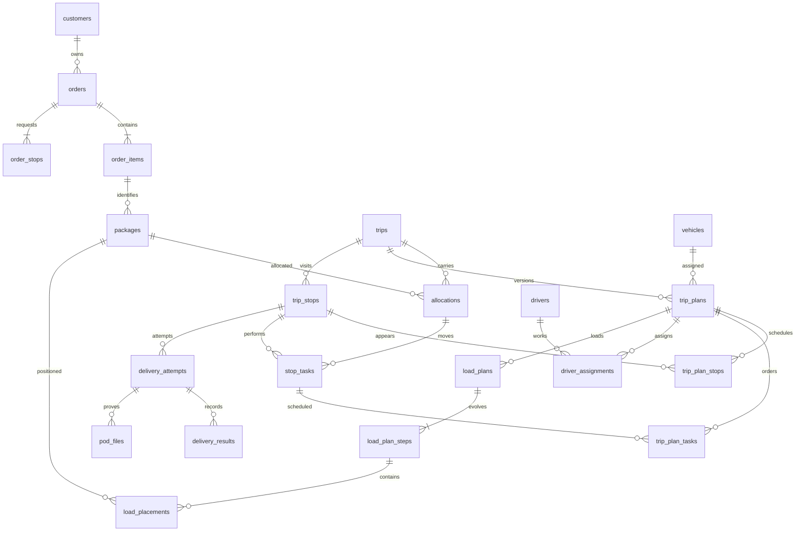

# THIẾT KẾ DATABASE TMS — DANH MỤC BẢNG VÀ QUAN HỆ

Phiên bản 0.1 · Ngày 09/09/2026 · PostgreSQL · Thiết kế đích đề xuất; nhiệm vụ này không tạo database/migration.

Tài liệu liên quan: [Kế hoạch TMS](KE_HOACH_TMS.md), [Rule AI](AGENTS.md), [Phân công 3 người](PHAN_CONG_3_NGUOI.md).

## 1. Phạm vi và trạng thái quyết định

Đã chốt: Mapbox; PostgreSQL; một xe chở nhiều hàng; không xếp chồng; xếp/dỡ không bị hàng khác cản; tái sử dụng chỗ trống sau dỡ; optimizer phải tính các thay đổi này cùng route.

Các tên bảng, cột, kiểu dữ liệu và quan hệ bên dưới là **phương án thiết kế để phản hồi**, chưa phải schema đã duyệt. Không tạo tất cả bảng ngay khi bắt đầu; triển khai theo phase được giao. Không thêm bảng WMS.

**Hiện trạng phát hiện khi bàn giao:** workspace đã có `backend`, `frontend` và [schema Prisma](backend/prisma/schema.prisma). Schema tại thời điểm đọc khai báo 15 model, ánh xạ tới `users`, `branches`, `vehicles`, `drivers`, `driver_shifts`, `customers`, `orders`, `order_stops`, `order_items`, `trips`, `trip_stops`, `allocations`, `stop_tasks`, `driver_assignments`, `audit_logs`. Chưa kiểm tra database thực hoặc trạng thái áp dụng migration. Danh mục bên dưới có **58 bảng đề xuất**, gồm **51 bảng P1–P3** và **7 bảng mở rộng có điều kiện**; không phải khẳng định database đang có 58 bảng. Một số bảng giữ tên nhưng đổi cấu trúc/quan hệ, vì vậy cần phân tích chênh lệch và dữ liệu hiện hữu trước migration.

Giả định thiết kế cần xác nhận:

- Một công ty nhiều chi nhánh. Chưa thiết kế đầy đủ SaaS nhiều công ty độc lập.
- Một Order có một pickup và một delivery ở MVP. Cấu trúc stop cho phép mở rộng nhưng không tự mở nghiệp vụ nhiều điểm.
- Một Trip dùng một xe; tài xế được phân công riêng theo thời gian. Đổi xe xử lý bằng chặng/bàn giao khi phase tương ứng được duyệt.
- Mỗi kiện vật lý có ID riêng; không chia nội dung một kiện trong MVP. “Giao một phần đơn” có thể là giao một số kiện, các kiện còn lại chưa giao. Nếu cần mở kiện/giao một phần nội dung, phải bổ sung mô hình số lượng bên trong trước triển khai.
- Bố trí một lớp được đề xuất cho quy tắc không chồng. Hình dạng kiện, pallet, hướng xoay và thiết bị bốc/dỡ chưa được chốt.
- Backend hiện có package NestJS và Prisma; đây là hiện trạng code được quan sát, không tự coi mọi quyết định thiết kế đã được duyệt. Ưu tiên đối chiếu/tái sử dụng hiện trạng thay vì tự đổi framework/ORM.

## 2. Quy ước chung

| Quy ước | Thiết kế đề xuất |
|---|---|
| Khóa chính | `id: uuid` cho bảng nghiệp vụ; bảng nối có thể dùng khóa ghép |
| Thời gian | `timestamptz`; lưu thời điểm UTC, lưu timezone riêng cho lịch địa phương |
| Theo dõi thay đổi | Bảng có thể sửa: `created_at`, `updated_at`, `version`; bảng lịch sử: append-only, correction có tham chiếu bản cũ |
| Khóa ngoại | Cột `*_id` bên dưới trỏ đến `id` bảng được ghi rõ; FK quan trọng không dùng tham chiếu đa hình tùy ý |
| Kích thước/vị trí | mm, `integer` hoặc `numeric` thống nhất; khối lượng gram `bigint`; thời lượng giây |
| Tiền | `numeric(20,4)` và mã tiền tệ; quy tắc làm tròn theo tiền tệ, không dùng float |
| Tọa độ | longitude/latitude số thập phân, kiểm tra phạm vi; PostGIS là lựa chọn sau |
| JSONB | Chỉ dùng cho snapshot, policy có version hoặc hình học phức tạp; không thay FK và cột cần truy vấn bằng JSON tùy ý |
| Trạng thái | Tập giá trị có kiểm soát, chuyển trạng thái bằng lệnh nghiệp vụ; danh sách dưới đây chưa là enum cuối |
| Null | Ghi rõ trường hợp thiếu/chưa biết; không dùng 0 cho kích thước, thời gian hoặc chi phí chưa có |
| Xóa | RESTRICT dữ liệu đã vận hành; đóng hiệu lực/hủy và audit. Cascade chỉ với con thuộc bản nháp được phép xóa |
| Phạm vi | Không tự thêm tenant_id rồi tuyên bố đã hỗ trợ multi-tenant |

Trong bảng mô tả, `?` nghĩa là có thể null trong trường hợp được nêu; các cột chính còn lại bắt buộc khi bản ghi đạt trạng thái sử dụng tương ứng. Nháp có thể thiếu dữ liệu được quy định rõ; trước xác nhận/publish phải kiểm tra đủ. Trường chung ở bảng trên được lược bỏ ở các dòng sau để dễ đọc.

## 3. Danh mục bảng theo nhóm

### 3.1. Danh tính, quyền và chi nhánh — P1

| Bảng | Mục đích và cột chính | Khóa/ràng buộc chính |
|---|---|---|
| `users` | Tài khoản: login, display_name, password_hash hoặc auth_subject, active | Unique login chuẩn hóa; không lưu mật khẩu thô; phương thức xác thực cần chốt |
| `roles` | code, name | Unique code |
| `permissions` | code, description | Unique code, ví dụ quyền publish Trip |
| `role_permissions` | role_id → roles, permission_id → permissions | PK ghép hai FK |
| `user_role_scopes` | user_id → users, role_id → roles, scope_type, branch_id? → branches | scope toàn công ty thì branch null; scope chi nhánh thì branch bắt buộc; unique cả trường hợp null |
| `branches` | code, name, address, longitude, latitude, timezone, operating_hours, active | Unique code; không có tồn kho/kệ |

`user_role_scopes` gắn **vai trò với phạm vi** trong cùng bản ghi, tránh vô tình cấp quyền quản trị toàn công ty cho người chỉ quản trị một chi nhánh. Phiên/token đăng nhập phụ thuộc phương án auth được chọn; nếu cần bảng session thì thiết kế trước triển khai auth, không mặc định đã có.

### 3.2. Khách hàng, đơn và từng kiện — P1

| Bảng | Mục đích và cột chính | Khóa/ràng buộc chính |
|---|---|---|
| `customers` | code, name, status, billing_reference? | Unique code; chưa bao gồm sổ kế toán |
| `customer_contacts` | customer_id → customers, name, phone, email?, contact_role | Một khách nhiều liên hệ; chỉ giữ dữ liệu cần thiết |
| `orders` | code, customer_id → customers, managing_branch_id → branches, status, priority, confirmed_at?, cancelled_at?, cancellation_reason? | Unique code; version chống sửa đè |
| `order_stops` | order_id → orders, stop_type, address_snapshot, contact_snapshot, longitude, latitude, location_verified_at?, window_start/end?, deadline?, deadline_basis, service_seconds | MVP một stop mỗi loại pickup/delivery; các time window theo policy |
| `order_items` | order_id → orders, description, package_type, declared_package_count, handling_requirements | Dòng hàng thương mại; không dùng một dòng đại diện một vật thể lớn giả |
| `packages` | order_item_id → order_items, package_code, length_mm, width_mm, height_mm, weight_g, allowed_orientations, measurement_source, measured_at?, status | Unique package_code; số đo dương trước tối ưu; không có cờ cho phép xếp chồng |
| `order_events` | order_id → orders, event_type, from/to_status?, actor_user_id? → users, occurred_at, command_id, payload | Append-only; lưu xác nhận, sửa, hủy và lý do |

Một dòng hàng “10 thùng” được biểu diễn thành 10 package ID để theo dõi xếp/dỡ; có thể hỗ trợ nhập hàng loạt nhưng không bỏ định danh từng kiện. Số kiện dự kiến trên order_items phải được đối chiếu với packages trước xác nhận. Kích thước của kiện đã vào kế hoạch được chụp snapshot; sửa số đo không làm thay đổi lịch sử bố trí cũ.

### 3.3. Xe, tài xế và lịch — P1; hoạt động thực tế mở ở P2/P4

| Bảng | Mục đích và cột chính | Khóa/ràng buộc chính |
|---|---|---|
| `vehicle_types` | code, name, required_license_category, handling_capabilities | Danh mục loại xe; không thay số đo từng xe |
| `vehicles` | plate, vehicle_type_id → vehicle_types, home_branch_id → branches, payload_limit_g, tare_weight_g?, usable_length/width/height_mm, operational_status | Unique biển số chuẩn hóa; hình học/tải dương trước điều phối |
| `vehicle_doors` | vehicle_id → vehicles, door_code, side, offset_mm, sill_height_mm, clear_width/height_mm, approach_geometry | Unique(vehicle_id, door_code); vị trí cửa phải nằm trên thùng phù hợp |
| `vehicle_obstacles` | vehicle_id → vehicles, name, geometry, geometry_version | Chướng ngại cố định nếu có; không coi cả hình hộp thùng là vùng trống |
| `vehicle_unavailability` | vehicle_id → vehicles, starts_at, ends_at?, reason, status | Bảo trì/hỏng; không là reservation chuyến |
| `drivers` | user_id? → users, employee_code, home_branch_id → branches, status, can_drive_night, can_long_distance | Unique employee_code; user_id unique khi có |
| `driver_licenses` | driver_id → drivers, category, valid_from, valid_until, verification_status | Đối chiếu đủ điều kiện trên toàn khoảng cần lái |
| `work_policies` | code, revision, effective_from/to?, jurisdiction, limits_json, approval_reference | Unique(code, revision); policy đã dùng bất biến |
| `driver_shifts` | driver_id → drivers, work_policy_id → work_policies, starts_at, ends_at, timezone, overtime_approved, status | Ngày giờ đầy đủ, end > start; không mặc định ca chung |
| `driver_leave` | driver_id → drivers, starts_at, ends_at, reason, status | Nghỉ đã duyệt tham gia kiểm tra availability |
| `driver_activity_events` | driver_id → drivers, trip_id? → trips, activity_type, occurred_at, received_at, source, correction_of_id? → cùng bảng | Lái/làm việc/nghỉ; append-only; không reset ở nửa đêm |

Chưa lưu `current_trip_id` hoặc `current_branch_id` trên xe/tài xế làm nguồn sự thật độc lập. Chuyến hiện tại suy ra từ phân công hợp lệ; vị trí hiện tại từ dữ liệu tracking có timestamp. Nếu cần projection để đọc nhanh phải có quy trình đồng bộ/tái tạo.

### 3.4. Chuyến, phiên bản kế hoạch và phân công — P1

| Bảng | Mục đích và cột chính | Khóa/ràng buộc chính |
|---|---|---|
| `trips` | code, managing_branch_id → branches, lifecycle_status, active_plan_id? → trip_plans, actual_started_at?, actual_ended_at? | Unique code; active_plan phải thuộc đúng Trip |
| `trip_plans` | trip_id → trips, revision, vehicle_id → vehicles, planned_start/end, start/end_location_snapshot, planning_snapshot, status, created_by → users, published_at? | Unique(trip_id, revision); bản publish bất biến; vehicle snapshot trong planning_snapshot |
| `trip_stops` | trip_id → trips, stop_kind, logical_reference | ID logic của stop được giữ khi tạo kế hoạch mới |
| `trip_plan_stops` | trip_plan_id → trip_plans, trip_stop_id → trip_stops, sequence, location_snapshot, window_start/end?, planned_arrival/service_start/departure | Unique(plan, sequence), unique(plan, stop); stop phải cùng Trip |
| `allocations` | package_id → packages, trip_id → trips, leg_number, status, released_at? | Một bản ghi cho một kiện trên một chặng; MVP một chặng hoạt động; lịch sử hủy/phân công lại không xóa |
| `stop_tasks` | trip_stop_id → trip_stops, allocation_id → allocations, action, order_stop_id → order_stops | Task lấy/giao một kiện; Trip/Order phải khớp qua allocation; không đồng nhất task với stop |
| `trip_plan_tasks` | trip_plan_id → trip_plans, stop_task_id → stop_tasks, operation_sequence, planned_start/end | Unique(plan, task), unique(plan, operation_sequence); task phải thuộc stop có trong plan |
| `driver_assignments` | trip_plan_id → trip_plans, driver_id → drivers, role, starts_at, ends_at, start/end_stop_id? → trip_stops, acceptance_status | Phân công có đoạn/thời gian; xác nhận tiếp nhận lưu lịch sử qua sự kiện thực thi |
| `resource_reservations` | trip_plan_id → trip_plans, vehicle_id? → vehicles, driver_id? → drivers, starts_at, ends_at, status | Chính xác một trong vehicle_id/driver_id; chặn giao nhau cho cùng tài nguyên khi active |

**Vì sao tách các bảng kế hoạch:** `trip_stops` và `stop_tasks` giữ ID nghiệp vụ ổn định; `trip_plan_stops`/`trip_plan_tasks` lưu thứ tự, thời gian theo revision. Sự kiện thực tế bám ID ổn định và version nguồn, nên tối ưu lại không làm mất lịch sử. `trip_plans` cụ thể hóa `plan_revisions` trong kế hoạch tổng; không cần tạo thêm bảng cùng chức năng tên `plan_revisions`.

**Tránh quan hệ vòng:** allocation không giữ FK trở lại pickup_task/delivery_task. Các task tham chiếu allocation; hệ thống kiểm tra đủ cặp pickup/delivery khi publish. Trip được tạo trước với active_plan null; tạo plan rồi cập nhật active_plan trong transaction có kiểm tra cùng Trip.

Phương án nháp có thể cạnh tranh cùng một kiện. Khi publish, backend phải khóa kiện/tài nguyên và bảo đảm chỉ một phân công hiện hành hợp lệ cho cùng phần hành trình. Kế hoạch tương lai đã phát hành cần có reservation dù Trip chưa chạy.

### 3.5. Bố trí động không chồng và kiểm chứng — bắt buộc ở P3

| Bảng | Mục đích và cột chính | Khóa/ràng buộc chính |
|---|---|---|
| `load_plans` | trip_plan_id → trip_plans, revision, initial_state_snapshot, geometry_snapshot, validation_status, validator_version, input_hash | Unique(trip_plan_id, revision); hình học/kiện/chính sách được chụp lại |
| `load_plan_steps` | load_plan_id → load_plans, step_number, trip_plan_task_id? → trip_plan_tasks, operation_type, package_id? → packages, door_id? → vehicle_doors, handling_path, validation_result | Step 0 là trạng thái đầu, không task; step > 0 gắn đúng thao tác; unique(load_plan_id, step_number) |
| `load_placements` | load_plan_step_id → load_plan_steps, package_id → packages, x_mm, y_mm, z_mm, orientation, effective_length/width/height_mm | Unique(step, package); lưu trạng thái **sau** bước đó; một lớp không chồng, không giao nhau |
| `load_observations` | trip_id → trips, source_load_step_id? → load_plan_steps, observed_at, actor_user_id → users, actual_layout_snapshot, verification_status | Bố trí thực tế do tài xế/nhân viên xác nhận; không sửa bố trí kế hoạch |

Quy ước hình học đề xuất: gốc tọa độ ở góc sàn gần cửa sau, x theo chiều dài hướng về đầu thùng, y theo chiều rộng, z theo chiều cao. Cần chốt hướng trái/phải và quy ước chiều quay trong contract. Snapshot chứa hệ tọa độ/version để web và Python diễn giải giống nhau.

Quy tắc dữ liệu bắt buộc:

- Mỗi trạng thái lưu các kiện còn trên xe, không chỉ tổng thể tích/tải còn trống. Khi unload A, trạng thái kế tiếp không còn A; B không tự đổi vị trí.
- Khi load C, C có vị trí không chiếm hàng khác, có đường đưa qua cửa và không cản việc giao các kiện sau đó.
- Với mô hình mặt sàn phẳng một lớp, đề xuất z = 0; không được thay z để đặt C lên B. Thùng/pallet đặc thù phải chốt hình học trước.
- Không có bảng “free_volume” làm nguồn sự thật. Vùng trống suy ra từ thùng, chướng ngại và placements; cache vùng trống phải gắn hash/version và có thể tái tạo.
- `handling_path` là quỹ đạo/vùng quét phục vụ kiểm tra thao tác theo mô hình được duyệt, không chỉ một đường vẽ trang trí.
- FK door_id phải thuộc đúng xe của plan; package phải thuộc manifest của Trip hoặc initial state hợp lệ. Kiện đã dỡ không được xuất hiện lại nếu chưa có thao tác load hợp lệ.
- Bố trí kế hoạch không chứng minh hàng thực tế đã được xếp đúng. Nếu thực tế khác, lưu observation và kiểm tra/tối ưu lại phần còn lại.
- DB bảo vệ khóa/quan hệ/miền giá trị; validator hình học kiểm tra va chạm, đường thao tác và khả năng dỡ tương lai. Không tuyên bố CHECK đơn giản kiểm chứng toàn bộ hình học.

Ví dụ:

| Bước | Thao tác | Placements sau bước | Kiểm tra |
|---|---|---|---|
| 0 | Đầu đoạn xét | A và B | Snapshot ban đầu hợp lệ |
| 1 | Dỡ A | Chỉ B, vị trí B giữ nguyên | A qua cửa không bị B chắn |
| 2 | Lấy C | B và C; C dùng vùng vừa trống | C vào được, không chồng, không chắn B |
| 3 | Dỡ B | Chỉ C | B ra được khi C còn trên xe |

Nếu C vừa diện tích nhưng chắn B ở bước 3, cả phương án bị loại/điều chỉnh. Các bước và snapshot giúp tái kiểm chứng bằng validator độc lập.

### 3.6. Thực thi, tracking, POD và sự cố — P2

| Bảng | Mục đích và cột chính | Khóa/ràng buộc chính |
|---|---|---|
| `execution_events` | trip_id → trips, trip_stop_id? → trip_stops, stop_task_id? → stop_tasks, source_plan_id → trip_plans, event_type, occurred_at, received_at, actor_user_id → users, command_id, payload | Append-only; kiểm tra các ID cùng Trip và quyền thực thi |
| `tracking_devices` | installation_key, user_id? → users, assigned_vehicle_id? → vehicles, source_type, active | Unique installation_key; nguồn điện thoại khác thiết bị xe |
| `gps_events` | tracking_device_id → tracking_devices, device_session_id, sequence, driver_id? → drivers, vehicle_id? → vehicles, trip_id? → trips, measured_at, received_at, lon, lat, accuracy_m, speed?, heading? | Unique(device, session, sequence) trước khi chốt partition; nguồn/gán xe phải được kiểm tra |
| `delivery_attempts` | trip_stop_id → trip_stops, source_plan_id → trip_plans, attempt_number, occurred_at, recipient_name?, result, failure_reason?, command_id | Unique(stop, attempt_number); command retry không tạo attempt mới |
| `delivery_results` | delivery_attempt_id → delivery_attempts, stop_task_id → stop_tasks, package_id → packages, result, reason? | Unique(attempt, package); package/task thuộc đúng stop/Order |
| `pod_files` | delivery_attempt_id → delivery_attempts, storage_key, checksum, media_type, upload_status, captured_at?, uploaded_at?, supersedes_id? → cùng bảng | Unique storage_key; metadata trong DB, nội dung tệp ở object storage |
| `incidents` | trip_id → trips, vehicle_id? → vehicles, driver_id? → drivers, type, severity, status, occurred_at, reporter_id → users, description, resolution? | Tài nguyên liên quan phải hợp lệ với sự cố; trạng thái có lịch sử |
| `incident_orders` | incident_id → incidents, order_id → orders | PK ghép; một sự cố ảnh hưởng nhiều đơn |
| `notifications` | user_id → users, trip_id? → trips, kind, payload, created_at, read_at? | Hộp thông báo trong ứng dụng có thể tải lại; socket không thay bảng này |

`execution_events` ghi thời điểm thực tế; projection của trạng thái stop/task có thể tái tạo. Không ghi giờ thực tế vào kế hoạch rồi mất dự toán cũ. Correction phải tham chiếu sự kiện cần sửa và giữ audit.

Đề xuất bảng `gps_events` chưa partition ở bản đầu. Nếu partition theo thời gian, thiết kế lại uniqueness chống trùng và retention trước migration; không mặc định khóa chống trùng toàn bộ thiết bị còn được bảo đảm chỉ bằng unique cục bộ từng partition. Vị trí mới nhất là projection/cache theo measured_at và chất lượng, không lấy đơn giản bản ghi có received_at lớn nhất.

### 3.7. Tác vụ tối ưu và nền tảng tin cậy — P1/P3

| Bảng | Mục đích và cột chính | Khóa/ràng buộc chính |
|---|---|---|
| `optimization_jobs` | requested_by → users, scope_branch_id → branches, status, snapshot, snapshot_hash, policy_version, solver_version, parameters, requested_at, started_at?, finished_at?, lease_until?, error_code? | Job ID ổn định; lease/retry/cancel có trạng thái, không chỉ ở Redis |
| `optimization_results` | optimization_job_id → optimization_jobs, candidate_number, result_snapshot, feasibility_status, objective_breakdown, diagnostics, created_at | Unique(job, candidate_number); chứa cả đơn chưa xếp và load plan ứng viên |
| `outbox_events` | event_id, aggregate_type, aggregate_id, aggregate_version, event_type, payload, created_at, published_at?, attempts | Unique event_id; ghi cùng transaction với thay đổi nghiệp vụ |
| `processed_commands` | actor_user_id → users, command_type, idempotency_key, request_hash, status, result, created_at | Unique(actor, command_type, key); cùng key khác payload bị từ chối |
| `audit_logs` | actor_user_id? → users, action, entity_type/id, occurred_at, correlation_id, change_summary | Append-only; không chứa token, ảnh hoặc payload cá nhân dư thừa |

`aggregate_id`/`entity_id` trong log là tham chiếu đa hình chỉ để truy vết, không dùng làm quan hệ nghiệp vụ thay FK. Snapshot job/result có schema version và validation, không là JSON không kiểm soát.

Python nhận snapshot và trả kết quả; **không trực tiếp ghi bảng Trip/Allocation/Reservation**. Backend import phương án được chọn thành trip_plans và load_plans nháp, giữ liên kết nguồn optimization result trong snapshot hoặc FK bổ sung khi chốt. Publish luôn kiểm tra lại dữ liệu hiện tại.

Không lưu matrix Mapbox lâu dài theo mặc định. Chỉ lưu/cache nội dung được phép theo điều kiện API; metadata/hash có thể được giữ để truy vết, nhưng không hứa replay đầy đủ nếu dữ liệu gốc không được phép lưu.

### 3.8. Bảng mở rộng có điều kiện — P4/P5, chưa tạo mặc định

| Bảng | Mục đích và cột chính | Điều kiện triển khai |
|---|---|---|
| `journeys` | code, managing_branch_id → branches, status, planned_start/end | Chốt Journey có vòng đời riêng |
| `journey_trips` | journey_id → journeys, trip_id → trips, sequence | Unique(journey, sequence); chốt một Trip có thuộc nhiều Journey không, đề xuất không |
| `cargo_transfers` | from_trip_id → trips, to_trip_id → trips, location_snapshot, planned_at, actual_at?, status, released_by?, received_by? → users | Quy trình bàn giao giữa xe được duyệt |
| `cargo_transfer_packages` | cargo_transfer_id → cargo_transfers, package_id → packages, from_allocation_id → allocations, to_allocation_id → allocations, condition, receipt_status | Unique(transfer, package); kiện không đồng thời được coi đang trên hai xe |
| `cost_entries` | trip_id → trips, category, amount, currency, basis, approval_status, source_reference?, occurred_at | Chốt dự toán/thực tế và quy trình duyệt |
| `cost_allocations` | cost_entry_id → cost_entries, order_id → orders, amount, allocation_method | Tổng phân bổ theo tiền tệ khớp khoản gốc |
| `order_charges` | order_id → orders, charge_type, amount, currency, source_reference, status | Chỉ khi chốt giá cước/doanh thu; không phải sổ kế toán đầy đủ |

Chưa đề xuất bảng Shipment độc lập vì chưa chốt vòng đời riêng. Không tạo cả Shipment và Trip chỉ để dùng tên tương tự. Phụ cấp/tăng ca có thể là cost_entries theo policy, chưa tạo module tính lương.

## 4. Sơ đồ quan hệ cốt lõi

Sơ đồ thể hiện phần nghiệp vụ chính ở trạng thái hợp lệ; bản nháp có thể chưa có đủ con. Danh mục bảng ở mục 3 là chi tiết chuẩn của bản thiết kế này.

## 5. Các transaction quan trọng

### 5.1. Publish kế hoạch

1. Nhận expected version và idempotency key, kiểm tra quyền.
2. Đọc plan/load plan đã qua validator và hash đầu vào tương ứng.
3. Khóa các tài nguyên/kiện theo thứ tự ổn định, đối chiếu lại đơn, lịch và bố trí thực tế liên quan.
4. Kiểm tra không trùng reservation, không phân bổ kiện trái phép và đủ thời gian di chuyển giữa việc trước/sau.
5. Chuyển reservation/allocations sang hiệu lực và cập nhật active_plan, ghi audit/outbox trong cùng transaction.
6. Khi conflict, rollback toàn bộ; không phát socket “đã publish” trước commit.

Không chạy solver dài trong transaction giữ khóa. Validator trả kết quả gắn input hash; nếu dữ liệu ảnh hưởng đã đổi thì không tái sử dụng kết quả kiểm tra cũ.

### 5.2. Dỡ hàng và nhận hàng tiếp theo

Lệnh dỡ A được ghi một lần; cập nhật trạng thái kiện và execution event. Bố trí thực tế sau thao tác được xác nhận/ghi nhận tương ứng, phần không gian A được giải phóng. Pickup C chỉ được xác nhận theo kế hoạch còn hiệu lực, tải và bố trí còn hợp lệ. Không suy ra thao tác thực tế đã xong từ giờ planned.

### 5.3. Giao một phần và gửi lại khi offline

Một delivery_attempt có kết quả riêng cho từng kiện. Retry cùng command trả kết quả đã xử lý, không thêm lần giao. Phần chưa giao giữ nơi giữ hàng/trip có căn cứ qua allocation và execution; không tự hoàn tất Order. Upload POD có trạng thái riêng và policy quyết định khi nào xác nhận giao nhận hoàn tất.

## 6. Index và kiểm tra dữ liệu cần thiết

- Unique code/plate/login được chuẩn hóa; FK được index theo truy vấn thực tế.
- orders: managing_branch_id + status + created_at; trip_plans: trip_id + revision.
- reservations: tài nguyên + khoảng thời gian, chặn overlap active bằng exclusion hoặc cơ chế khóa tương đương được test đồng thời; vehicle_id và driver_id có FK thật.
- execution_events: trip_id + occurred_at; order_events: order_id + occurred_at.
- gps_events: trip_id + measured_at và device/session/sequence; xem lại khi partition.
- placements: step_id + package_id; không index toàn bộ JSON hình học theo mặc định.
- optimization_jobs: status + requested_at; outbox: tập chưa publish; notifications: user_id + read_at + created_at.
- Ràng buộc cùng Trip/Order/plan giữa các FK dùng composite FK hoặc kiểm tra transaction/trigger có test. Chỉ từng FK riêng lẻ tồn tại chưa đủ bảo đảm chúng thuộc cùng một kế hoạch.
- Trạng thái chuyển hợp lệ, đủ cặp pickup/delivery, tổng phân bổ và hình học cần validation nhiều bản ghi; không diễn tả sai rằng mọi quy tắc chỉ cần CHECK trên một hàng.

## 7. Thứ tự triển khai schema khi được phép

1. Danh tính/chi nhánh, khách hàng và resource master.
2. Order, kiện, lịch và policy đã chốt.
3. Trip, kế hoạch phiên bản, allocation/task, reservation; outbox/idempotency/audit đi cùng lệnh đầu tiên cần chúng.
4. Thực thi, tracking, POD và sự cố cho P2.
5. Job/result và bố trí từng bước cho P3; chuẩn bị contract hình học sớm từ P0/P1 để tránh phải đổi dữ liệu kiện/xe muộn.
6. Bảng Journey/chuyển tải/chi phí chỉ thêm khi phạm vi được duyệt.

Không tạo migration trong giai đoạn tài liệu này. Khi triển khai cần test trên database trống, dữ liệu đại diện và nâng cấp schema có dữ liệu nếu đã có phiên bản trước.

## 8. Những điểm phải chốt trước migration liên quan

- Mức kiện/pallet và việc có mở kiện/giao lẻ nội dung hay không.
- Hình dạng hàng/thùng, hướng xoay, khoảng hở và phương tiện thao tác.
- Một/nhiều pickup-delivery; chia đơn qua nhiều chặng; định nghĩa Shipment/Journey.
- Phân quyền liên chi nhánh, phương thức đăng nhập và có nhiều công ty độc lập không.
- Policy ca/nghỉ, loại bằng và phạm vi áp dụng; không tự đặt giới hạn pháp lý.
- Vòng đời Trip/Order/POD cuối cùng; xử lý khi thực tế khác bản kế hoạch offline.
- Retention GPS/POD, object storage, quy mô dữ liệu và các API Mapbox được sử dụng.

Danh mục này cụ thể hóa mục 8 của kế hoạch tổng. Những khác biệt tên bảng như `trip_plans` thay `plan_revisions`, hoặc tách bảng order_items/packages, là đề xuất chuẩn hóa; cần được duyệt khi chốt schema, không coi là database đã tồn tại.
