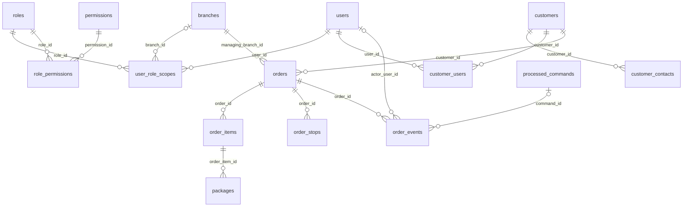
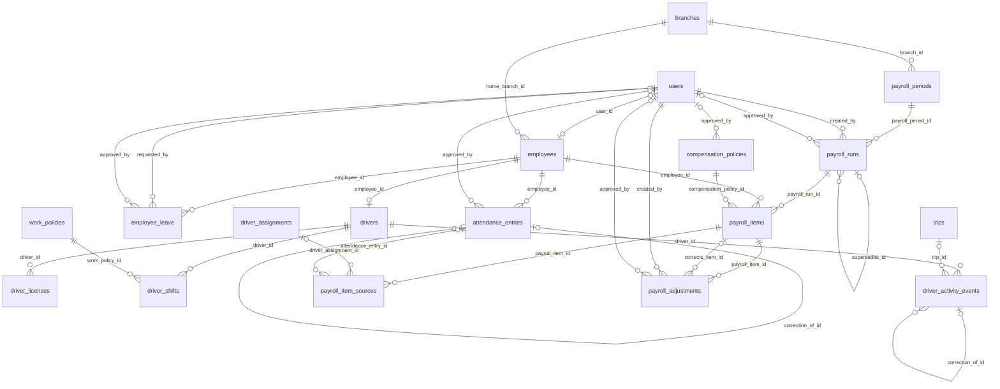
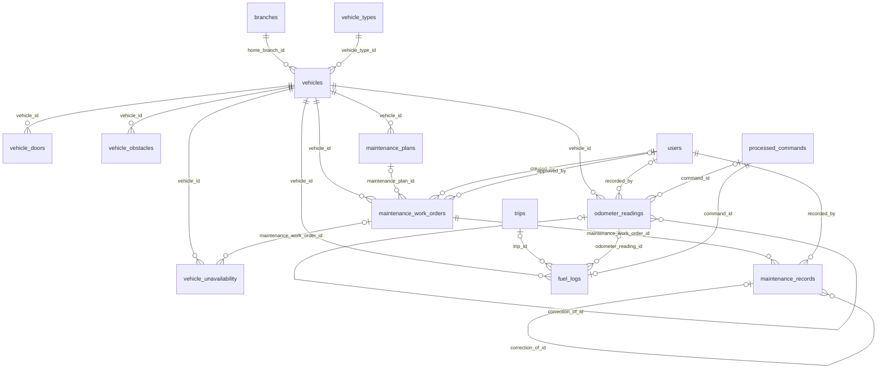
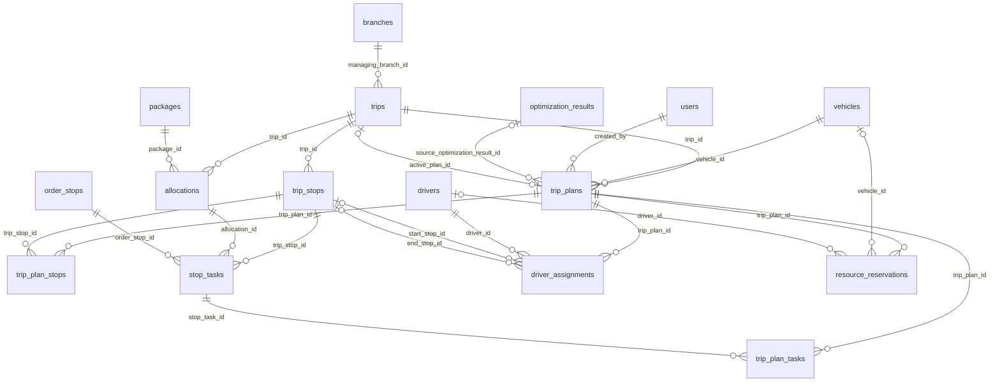
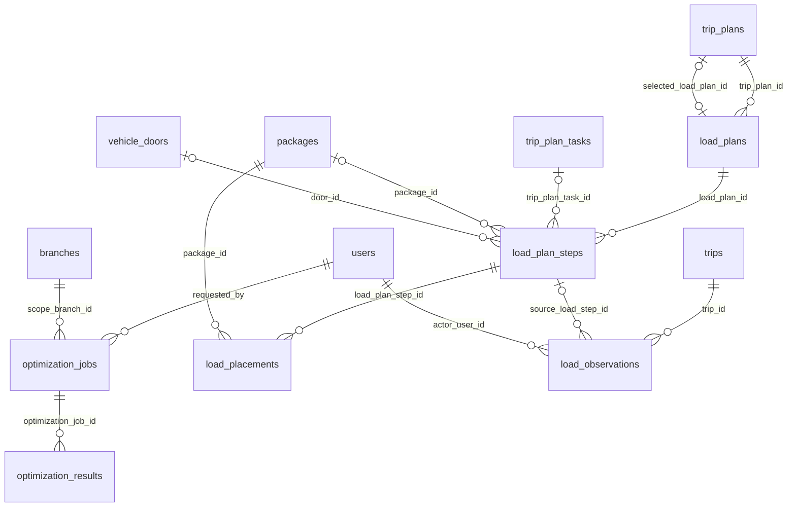
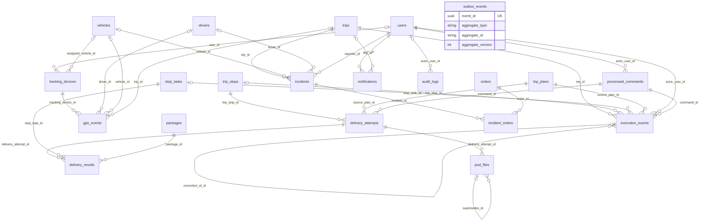
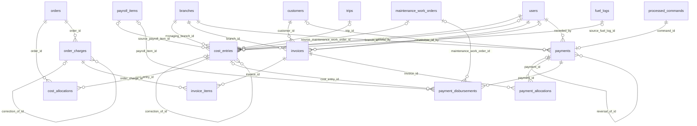
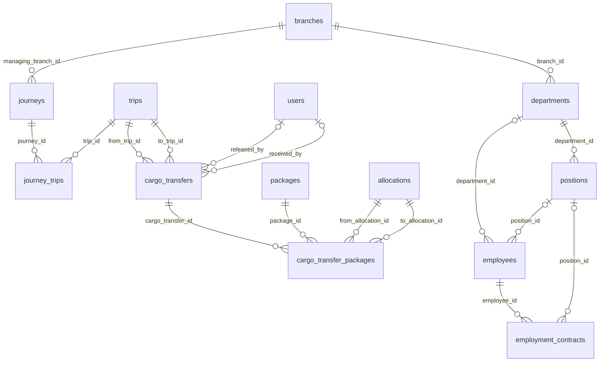

# THIẾT KẾ DATABASE TMS — DANH MỤC BẢNG VÀ QUAN HỆ

Phiên bản 0.2 · Ngày 23/09/2026 · PostgreSQL · Chốt cấu trúc logic và quan hệ làm chuẩn chung; chưa đồng bộ schema/migration, chưa kiểm chứng database thực.

Tài liệu liên quan: [Kế hoạch TMS](KE_HOACH_TMS.md), [Rule AI](AGENTS.md), [Phân công 3 người](PHAN_CONG_3_NGUOI.md).

## 1. Phạm vi và trạng thái quyết định

Đã chốt: Mapbox; PostgreSQL; một xe chở nhiều hàng; không xếp chồng; xếp/dỡ không bị hàng khác cản; tái sử dụng chỗ trống sau dỡ; optimizer phải tính các thay đổi này cùng route.

Theo yêu cầu người dùng ngày 23/09/2026, bản này chốt cấu trúc logic cho nghiệp vụ vận tải và phần Người 3: nhân sự vận hành, lương, bảo dưỡng, chi phí và thanh toán. Các quyết định cấu trúc ở đây là chuẩn để ba người thống nhất hợp đồng dữ liệu; việc đặt tên cột vật lý phải có ánh xạ tương ứng. Phần ghi **cần chốt policy** hoặc **mở rộng có điều kiện** không tự trở thành nghiệp vụ đã duyệt. Không thêm WMS, HRM hoặc kế toán tổng hợp.

**Hiện trạng đối chiếu:** schema Prisma hiện có 47 model; migration mở rộng khai báo 30 bảng không có model tương ứng trong schema. Lịch sử migration trong repository thiếu bước tạo 15 bảng nền ban đầu. Chưa có bằng chứng về database thực hoặc migration đã áp dụng. Danh mục đích ở mục 3 và các ERD ở mục 4 không phải tuyên bố bảng đã được tạo. Danh sách chênh lệch và trình tự chuyển đổi nằm ở mục 9.

Danh mục v0.2 có **80 bảng logic**, được thể hiện trong **8 ERD**. Trong đó 7 bảng ở mục 3.8 và 3.13 là mở rộng có điều kiện; 73 bảng còn lại thuộc các nhóm chức năng đã phân công, triển khai theo thứ tự phụ thuộc và policy liên quan, không phải yêu cầu tạo đồng loạt ở P1.

Lần cập nhật này chỉ chỉnh tài liệu. Quyền triển khai ứng dụng/database vẫn theo AGENTS.md; không chạy migration từ yêu cầu chốt thiết kế này.

Ranh giới cấu trúc và chính sách còn mở:

- Một công ty nhiều chi nhánh. Chưa thiết kế đầy đủ SaaS nhiều công ty độc lập.
- Một Order có một pickup và một delivery ở MVP. Cấu trúc stop cho phép mở rộng nhưng không tự mở nghiệp vụ nhiều điểm.
- Một Trip dùng một xe; tài xế được phân công riêng theo thời gian. Đổi xe xử lý bằng chặng/bàn giao khi phase tương ứng được duyệt.
- Chốt định danh từng kiện vật lý bằng Package; mỗi allocation mới tham chiếu một kiện. “Giao một phần đơn” theo mô hình này là giao một số kiện. Việc mở kiện/giao lẻ nội dung, nhiều pickup/delivery và chia đơn chủ động còn phải chốt policy trước khi mở chức năng.
- Bố trí một lớp được đề xuất cho quy tắc không chồng. Hình dạng kiện, pallet, hướng xoay và thiết bị bốc/dỡ chưa được chốt.
- Backend hiện có package NestJS và Prisma; đây là hiện trạng code được quan sát, không tự coi mọi quyết định thiết kế đã được duyệt. Ưu tiên đối chiếu/tái sử dụng hiện trạng thay vì tự đổi framework/ORM.

## 2. Quy ước chung

| Quy ước | Thiết kế thống nhất |
|---|---|
| Khóa chính | `id: uuid` cho bảng nghiệp vụ; bảng nối có thể dùng khóa ghép |
| Thời gian | `timestamptz`; lưu thời điểm UTC, lưu timezone riêng cho lịch địa phương |
| Theo dõi thay đổi | Bảng có thể sửa: `created_at`, `updated_at`, `version`; bảng lịch sử: append-only, correction có tham chiếu bản cũ |
| Khóa ngoại | Cột `*_id` bên dưới trỏ đến `id` bảng được ghi rõ; FK quan trọng không dùng tham chiếu đa hình tùy ý |
| Kích thước/vị trí | mm, `integer` hoặc `numeric` thống nhất; khối lượng gram `bigint`; thời lượng giây |
| Tiền | `numeric(20,4)` và mã tiền tệ; quy tắc làm tròn theo tiền tệ, không dùng float |
| Tọa độ | longitude/latitude số thập phân, kiểm tra phạm vi; PostGIS là lựa chọn sau |
| JSONB | Chỉ dùng cho snapshot, policy có version hoặc hình học phức tạp; không thay FK và cột cần truy vấn bằng JSON tùy ý |
| Trạng thái | Tập giá trị có kiểm soát, chuyển trạng thái bằng lệnh nghiệp vụ; danh sách dưới đây chưa là enum cuối |
| Null | Ghi rõ trường hợp thiếu/chưa biết; không dùng 0 cho kích thước, thời gian hoặc chi phí chưa có |
| Xóa | RESTRICT các quan hệ nghiệp vụ/lịch sử; hủy hoặc đóng hiệu lực khi đã vận hành. Xóa nháp bằng lệnh kiểm tra trạng thái và xóa con trong transaction; không dùng Cascade vô điều kiện để giả lập “chỉ xóa nháp” |
| Phạm vi | Không tự thêm tenant_id rồi tuyên bố đã hỗ trợ multi-tenant |

Trong bảng mô tả, `?` nghĩa là có thể null trong trường hợp được nêu; các cột chính còn lại bắt buộc khi bản ghi đạt trạng thái sử dụng tương ứng. Nháp có thể thiếu dữ liệu được quy định rõ; trước xác nhận/publish phải kiểm tra đủ. Trường chung ở bảng trên được lược bỏ ở các dòng sau để dễ đọc.

## 3. Danh mục bảng theo nhóm

### 3.1. Danh tính, quyền và chi nhánh — P1

| Bảng | Mục đích và cột chính | Khóa/ràng buộc chính |
|---|---|---|
| `users` | Tài khoản: login, display_name, password_hash hoặc auth_subject, active | Unique login chuẩn hóa; không lưu mật khẩu thô; phương thức xác thực cần chốt |
| `roles` | code, name | Unique code |
| `permissions` | code, description | Unique code, ví dụ quyền publish Trip |
| `role_permissions` | role_id → roles, permission_id → permissions | PK ghép hai FK |
| `user_role_scopes` | user_id → users, role_id → roles, scope_type, branch_id? → branches | scope toàn công ty thì branch null; scope chi nhánh thì branch bắt buộc; unique cả trường hợp null |
| `branches` | code, name, address, longitude, latitude, timezone, operating_hours, active | Unique code; không có tồn kho/kệ |

`user_role_scopes` gắn **vai trò với phạm vi** trong cùng bản ghi, tránh vô tình cấp quyền quản trị toàn công ty cho người chỉ quản trị một chi nhánh. Phiên/token đăng nhập phụ thuộc phương án auth được chọn; nếu cần bảng session thì thiết kế trước triển khai auth, không mặc định đã có.

Chốt `roles`/`permissions`/`user_role_scopes` là nguồn quyền nội bộ. `User.role` cũ chỉ là dữ liệu chuyển tiếp, không được cùng tồn tại như nguồn quyền thứ hai. Quyền của tài khoản khách hàng lấy từ liên kết `customer_users` và policy hành động khách hàng; không cấp vai trò điều phối nội bộ mặc định. Ma trận hành động được phép vẫn cần duyệt trước API liên quan.

### 3.2. Khách hàng, đơn và từng kiện — P1

| Bảng | Mục đích và cột chính | Khóa/ràng buộc chính |
|---|---|---|
| `customers` | code, name, status, billing_reference? | Unique code; chưa bao gồm sổ kế toán |
| `customer_contacts` | customer_id → customers, name, phone, email?, contact_role | Một khách nhiều liên hệ; chỉ giữ dữ liệu cần thiết |
| `customer_users` | customer_id → customers, user_id → users, active | Unique(customer_id, user_id); quyền truy cập đơn/hóa đơn phải khớp customer_id; số khách tối đa trên một tài khoản là policy cần chốt, không ngầm thêm unique(user_id) |
| `orders` | code, customer_id → customers, managing_branch_id → branches, status, priority, confirmed_at?, cancelled_at?, cancellation_reason? | Unique code; version chống sửa đè |
| `order_stops` | order_id → orders, stop_type, address_snapshot, contact_snapshot, longitude, latitude, location_verified_at?, window_start/end?, deadline?, deadline_basis, service_seconds | MVP một stop mỗi loại pickup/delivery; các time window theo policy |
| `order_items` | order_id → orders, description, package_type, declared_package_count, handling_requirements | Dòng hàng thương mại; không dùng một dòng đại diện một vật thể lớn giả |
| `packages` | order_item_id → order_items, package_code, length_mm, width_mm, height_mm, weight_g, allowed_orientations, measurement_source, measured_at?, status | Unique package_code; số đo dương trước tối ưu; không có cờ cho phép xếp chồng |
| `order_events` | order_id → orders, event_type, from/to_status?, actor_user_id? → users, occurred_at, command_id? → processed_commands, event_sequence, payload | Append-only; unique(command_id, event_sequence) khi có command; một lệnh có thể sinh nhiều sự kiện |

Một dòng hàng “10 thùng” được biểu diễn thành 10 package ID để theo dõi xếp/dỡ; có thể hỗ trợ nhập hàng loạt nhưng không bỏ định danh từng kiện. Số kiện dự kiến trên order_items phải được đối chiếu với packages trước xác nhận. Kích thước của kiện đã vào kế hoạch được chụp snapshot; sửa số đo không làm thay đổi lịch sử bố trí cũ.

### 3.3. Xe, tài xế và lịch — P1; hoạt động thực tế mở ở P2/P4

| Bảng | Mục đích và cột chính | Khóa/ràng buộc chính |
|---|---|---|
| `vehicle_types` | code, name, required_license_category, handling_capabilities | Danh mục loại xe; không thay số đo từng xe |
| `vehicles` | plate, vehicle_type_id → vehicle_types, home_branch_id → branches, payload_limit_g, tare_weight_g?, usable_length/width/height_mm, operational_status | Unique biển số chuẩn hóa; hình học/tải dương trước điều phối |
| `vehicle_doors` | vehicle_id → vehicles, door_code, side, offset_mm, sill_height_mm, clear_width/height_mm, approach_geometry | Unique(vehicle_id, door_code); vị trí cửa phải nằm trên thùng phù hợp |
| `vehicle_obstacles` | vehicle_id → vehicles, name, geometry, geometry_version | Chướng ngại cố định nếu có; không coi cả hình hộp thùng là vùng trống |
| `vehicle_unavailability` | vehicle_id → vehicles, maintenance_work_order_id? → maintenance_work_orders, starts_at, ends_at?, reason, status | Xe của phiếu phải trùng vehicle_id; một phiếu có thể có nhiều khoảng lịch sử; không là reservation chuyến |
| `drivers` | employee_id → employees, status, can_drive_night, can_long_distance | Unique employee_id; tài khoản, tên và chi nhánh nhân sự lấy qua Employee; bằng lái là dữ liệu chuyên môn riêng |
| `driver_licenses` | driver_id → drivers, category, valid_from, valid_until, verification_status | Đối chiếu đủ điều kiện trên toàn khoảng cần lái |
| `work_policies` | code, revision, effective_from/to?, jurisdiction, limits_json, approval_reference | Unique(code, revision); policy đã dùng bất biến |
| `driver_shifts` | driver_id → drivers, work_policy_id → work_policies, starts_at, ends_at, timezone, overtime_approved, status | Ngày giờ đầy đủ, end > start; không mặc định ca chung |
| `driver_activity_events` | driver_id → drivers, trip_id? → trips, activity_type, occurred_at, received_at, source, correction_of_id? → cùng bảng | Lái/làm việc/nghỉ; append-only; không reset ở nửa đêm |

Chưa lưu `current_trip_id` hoặc `current_branch_id` trên xe/tài xế làm nguồn sự thật độc lập. Chuyến hiện tại suy ra từ phân công hợp lệ; vị trí hiện tại từ dữ liệu tracking có timestamp. Nếu cần projection để đọc nhanh phải có quy trình đồng bộ/tái tạo.

Nghỉ phép lấy từ `employee_leave` qua `drivers.employee_id`; không duy trì thêm nguồn ghi `driver_leave`. Lịch làm việc tài xế vẫn ở `driver_shifts`; giờ lái/nghỉ thực tế ở `driver_activity_events`, không suy từ chấm công hoặc qua nửa đêm. Phạm vi hiện tại là nhân sự do công ty quản lý; tài xế thuê ngoài cần đặc tả riêng. Chi nhánh quản lý không quyết định vị trí hiện tại của tài xế.

### 3.4. Chuyến, phiên bản kế hoạch và phân công — P1

| Bảng | Mục đích và cột chính | Khóa/ràng buộc chính |
|---|---|---|
| `trips` | code, managing_branch_id → branches, lifecycle_status, active_plan_id? → trip_plans, actual_started_at?, actual_ended_at? | Unique code; active_plan phải thuộc đúng Trip |
| `trip_plans` | trip_id → trips, revision, vehicle_id → vehicles, source_optimization_result_id? → optimization_results, selected_load_plan_id? → load_plans, planned_start/end, start/end_location_snapshot, planning_snapshot, status, created_by → users, published_at? | Unique(trip_id, revision); selected_load_plan phải thuộc cùng plan; nội dung bản publish bất biến; nguồn tối ưu null với phương án thủ công |
| `trip_stops` | trip_id → trips, stop_kind, logical_reference | ID logic của stop được giữ khi tạo kế hoạch mới |
| `trip_plan_stops` | trip_plan_id → trip_plans, trip_stop_id → trip_stops, sequence, location_snapshot, window_start/end?, planned_arrival/service_start/departure | Unique(plan, sequence), unique(plan, stop); stop phải cùng Trip |
| `allocations` | package_id → packages, trip_id → trips, leg_number, status, released_at? | Một bản ghi cho một kiện trên một chặng; MVP một chặng hoạt động; lịch sử hủy/phân công lại không xóa |
| `stop_tasks` | trip_stop_id → trip_stops, allocation_id → allocations, action, order_stop_id → order_stops | Task lấy/giao một kiện; Trip/Order phải khớp qua allocation; không đồng nhất task với stop |
| `trip_plan_tasks` | trip_plan_id → trip_plans, stop_task_id → stop_tasks, operation_sequence, planned_start/end | Unique(plan, task), unique(plan, operation_sequence); task phải thuộc stop có trong plan |
| `driver_assignments` | trip_plan_id → trip_plans, driver_id → drivers, role, starts_at, ends_at, start/end_stop_id? → trip_stops, acceptance_status | Phân công có đoạn/thời gian; xác nhận tiếp nhận lưu lịch sử qua sự kiện thực thi |
| `resource_reservations` | trip_plan_id → trip_plans, vehicle_id? → vehicles, driver_id? → drivers, starts_at, ends_at, status, hold_expires_at? | Chính xác một trong vehicle_id/driver_id; HELD và ACTIVE đều giữ lịch; RELEASED/CANCELLED không giữ; HELD bắt buộc có hạn giữ |

**Vì sao tách các bảng kế hoạch:** `trip_stops` và `stop_tasks` giữ ID nghiệp vụ ổn định; `trip_plan_stops`/`trip_plan_tasks` lưu thứ tự, thời gian theo revision. Sự kiện thực tế bám ID ổn định và version nguồn, nên tối ưu lại không làm mất lịch sử. `trip_plans` cụ thể hóa `plan_revisions` trong kế hoạch tổng; không cần tạo thêm bảng cùng chức năng tên `plan_revisions`.

**Khởi tạo các tham chiếu chọn bản:** allocation không giữ FK trở lại pickup_task/delivery_task. Các task tham chiếu allocation; hệ thống kiểm tra đủ cặp pickup/delivery khi publish. Trip được tạo với active_plan null; Plan được tạo với selected_load_plan null. Tạo các bản con xong mới gán FK chọn bản trong transaction, kiểm tra cùng Trip/Plan. Quan hệ hai chiều này không yêu cầu tạo hai bản ghi đồng thời và không tạo thêm bảng trùng chức năng.

Phương án nháp có thể cạnh tranh cùng một kiện. Khi publish, backend phải khóa kiện/tài nguyên và bảo đảm chỉ một phân công hiện hành hợp lệ cho cùng phần hành trình. Kế hoạch tương lai đã phát hành cần có reservation dù Trip chưa chạy.

Chốt vòng đời allocation: PROPOSED → ACTIVE → FULFILLED hoặc RELEASED; CANCELLED dành cho đề xuất bỏ trước hiệu lực. Mỗi kiện chỉ có một allocation ACTIVE trong phạm vi một chặng đang khai thác; hoàn tất giao/bàn giao hợp lệ mới kết thúc allocation cũ. Tính toán nhiều plan nháp của cùng Trip tái sử dụng allocation/task ổn định; quan hệ `trip_plan_tasks` xác định manifest của từng bản. Lịch sử bản cũ không mất khi allocation hiện tại đổi trạng thái.

### 3.5. Bố trí động không chồng và kiểm chứng — bắt buộc ở P3

| Bảng | Mục đích và cột chính | Khóa/ràng buộc chính |
|---|---|---|
| `load_plans` | trip_plan_id → trip_plans, revision, initial_state_snapshot, geometry_snapshot, validation_status, validator_version, input_hash | Unique(trip_plan_id, revision); hình học/kiện/chính sách được chụp lại |
| `load_plan_steps` | load_plan_id → load_plans, step_number, trip_plan_task_id? → trip_plan_tasks, operation_type, package_id? → packages, door_id? → vehicle_doors, handling_path, validation_result | Step 0 là trạng thái đầu, không task; step > 0 gắn đúng thao tác; unique(load_plan_id, step_number) |
| `load_placements` | load_plan_step_id → load_plan_steps, package_id → packages, x_mm, y_mm, z_mm, orientation, effective_length/width/height_mm | Unique(step, package); lưu trạng thái **sau** bước đó; một lớp không chồng, không giao nhau |
| `load_observations` | trip_id → trips, source_load_step_id? → load_plan_steps, observed_at, actor_user_id → users, actual_layout_snapshot, verification_status | Bố trí thực tế do tài xế/nhân viên xác nhận; không sửa bố trí kế hoạch |

Quy ước hình học đề xuất: gốc tọa độ ở góc sàn gần cửa sau, x theo chiều dài hướng về đầu thùng, y theo chiều rộng, z theo chiều cao. Cần chốt hướng trái/phải và quy ước chiều quay trong contract. Snapshot chứa hệ tọa độ/version để web và Python diễn giải giống nhau.

Quy tắc dữ liệu bắt buộc:

- Mỗi trạng thái lưu các kiện còn trên xe, không chỉ tổng thể tích/tải còn trống. Khi unload A, trạng thái kế tiếp không còn A; B không tự đổi vị trí.
- Khi load C, C có vị trí không chiếm hàng khác, có đường đưa qua cửa và không cản việc giao các kiện sau đó.
- Với mô hình mặt sàn phẳng một lớp, đề xuất z = 0; không được thay z để đặt C lên B. Thùng/pallet đặc thù phải chốt hình học trước.
- Không có bảng “free_volume” làm nguồn sự thật. Vùng trống suy ra từ thùng, chướng ngại và placements; cache vùng trống phải gắn hash/version và có thể tái tạo.
- `handling_path` là quỹ đạo/vùng quét phục vụ kiểm tra thao tác theo mô hình được duyệt, không chỉ một đường vẽ trang trí.
- FK door_id phải thuộc đúng xe của plan; package phải thuộc manifest của Trip hoặc initial state hợp lệ. Kiện đã dỡ không được xuất hiện lại nếu chưa có thao tác load hợp lệ.
- Bố trí kế hoạch không chứng minh hàng thực tế đã được xếp đúng. Nếu thực tế khác, lưu observation và kiểm tra/tối ưu lại phần còn lại.
- DB bảo vệ khóa/quan hệ/miền giá trị; validator hình học kiểm tra va chạm, đường thao tác và khả năng dỡ tương lai. Không tuyên bố CHECK đơn giản kiểm chứng toàn bộ hình học.

Ví dụ:

| Bước | Thao tác | Placements sau bước | Kiểm tra |
|---|---|---|---|
| 0 | Đầu đoạn xét | A và B | Snapshot ban đầu hợp lệ |
| 1 | Dỡ A | Chỉ B, vị trí B giữ nguyên | A qua cửa không bị B chắn |
| 2 | Lấy C | B và C; C dùng vùng vừa trống | C vào được, không chồng, không chắn B |
| 3 | Dỡ B | Chỉ C | B ra được khi C còn trên xe |

Nếu C vừa diện tích nhưng chắn B ở bước 3, cả phương án bị loại/điều chỉnh. Các bước và snapshot giúp tái kiểm chứng bằng validator độc lập.

### 3.6. Thực thi, tracking, POD và sự cố — P2

| Bảng | Mục đích và cột chính | Khóa/ràng buộc chính |
|---|---|---|
| `execution_events` | trip_id → trips, trip_stop_id? → trip_stops, stop_task_id? → stop_tasks, source_plan_id → trip_plans, event_type, occurred_at, received_at, actor_user_id → users, command_id → processed_commands, event_sequence, correction_of_id? → execution_events, payload | Append-only; unique(command_id, event_sequence); correction cùng Trip và không tự tham chiếu; kiểm tra các ID cùng Trip và quyền thực thi |
| `tracking_devices` | installation_key, user_id? → users, assigned_vehicle_id? → vehicles, source_type, active | Unique installation_key; nguồn điện thoại khác thiết bị xe |
| `gps_events` | tracking_device_id → tracking_devices, device_session_id, sequence, driver_id? → drivers, vehicle_id? → vehicles, trip_id? → trips, measured_at, received_at, lon, lat, accuracy_m, speed?, heading? | Unique(device, session, sequence) trước khi chốt partition; nguồn/gán xe phải được kiểm tra |
| `delivery_attempts` | trip_stop_id → trip_stops, source_plan_id → trip_plans, attempt_number, occurred_at, recipient_name?, result, failure_reason?, command_id → processed_commands | Unique(stop, attempt_number), unique(command_id, trip_stop_id); command retry không tạo attempt mới |
| `delivery_results` | delivery_attempt_id → delivery_attempts, stop_task_id → stop_tasks, package_id → packages, result, reason? | Unique(attempt, package); package/task thuộc đúng stop/Order |
| `pod_files` | delivery_attempt_id → delivery_attempts, storage_key, checksum, media_type, upload_status, captured_at?, uploaded_at?, supersedes_id? → cùng bảng | Unique storage_key; metadata trong DB, nội dung tệp ở object storage |
| `incidents` | trip_id → trips, vehicle_id? → vehicles, driver_id? → drivers, type, severity, status, occurred_at, reporter_id → users, description, resolution? | Tài nguyên liên quan phải hợp lệ với sự cố; trạng thái có lịch sử |
| `incident_orders` | incident_id → incidents, order_id → orders | PK ghép; một sự cố ảnh hưởng nhiều đơn |
| `notifications` | user_id → users, trip_id? → trips, kind, payload, created_at, read_at? | Hộp thông báo trong ứng dụng có thể tải lại; socket không thay bảng này |

`execution_events` ghi thời điểm thực tế; projection của trạng thái stop/task có thể tái tạo. Không ghi giờ thực tế vào kế hoạch rồi mất dự toán cũ. Correction phải tham chiếu sự kiện cần sửa và giữ audit.

Đề xuất bảng `gps_events` chưa partition ở bản đầu. Nếu partition theo thời gian, thiết kế lại uniqueness chống trùng và retention trước migration; không mặc định khóa chống trùng toàn bộ thiết bị còn được bảo đảm chỉ bằng unique cục bộ từng partition. Vị trí mới nhất là projection/cache theo measured_at và chất lượng, không lấy đơn giản bản ghi có received_at lớn nhất.

### 3.7. Tác vụ tối ưu và nền tảng tin cậy — P1/P3

| Bảng | Mục đích và cột chính | Khóa/ràng buộc chính |
|---|---|---|
| `optimization_jobs` | requested_by → users, scope_branch_id → branches, status, snapshot, snapshot_hash, policy_version, solver_version, parameters, requested_at, started_at?, finished_at?, lease_until?, error_code? | Job ID ổn định; lease/retry/cancel có trạng thái, không chỉ ở Redis |
| `optimization_results` | optimization_job_id → optimization_jobs, candidate_number, result_snapshot, feasibility_status, objective_breakdown, diagnostics, created_at | Unique(job, candidate_number); chứa cả đơn chưa xếp và load plan ứng viên |
| `outbox_events` | event_id, aggregate_type, aggregate_id, aggregate_version, event_type, payload, created_at, published_at?, attempts | Unique event_id; ghi cùng transaction với thay đổi nghiệp vụ |
| `processed_commands` | actor_user_id → users, command_type, idempotency_key, request_hash, status, result, created_at | Unique(actor, command_type, key); cùng key khác payload bị từ chối |
| `audit_logs` | actor_user_id? → users, action, entity_type/id, occurred_at, correlation_id, change_summary | Append-only; không chứa token, ảnh hoặc payload cá nhân dư thừa |

`aggregate_id`/`entity_id` trong log là tham chiếu đa hình chỉ để truy vết, không dùng làm quan hệ nghiệp vụ thay FK. Snapshot job/result có schema version và validation, không là JSON không kiểm soát.

Python nhận snapshot và trả kết quả; **không trực tiếp ghi bảng Trip/Allocation/Reservation**. Backend import phương án được chọn thành trip_plans và load_plans nháp. Chốt FK `trip_plans.source_optimization_result_id`; cùng một kết quả có thể tạo nhiều TripPlan. Snapshot lưu thêm chỉ số route ứng viên và lịch sử chỉnh tay; FK là nguồn truy vết gốc, không khẳng định bản đã sửa vẫn giống nguyên kết quả solver. Publish luôn kiểm tra lại dữ liệu hiện tại.

Không lưu matrix Mapbox lâu dài theo mặc định. Chỉ lưu/cache nội dung được phép theo điều kiện API; metadata/hash có thể được giữ để truy vết, nhưng không hứa replay đầy đủ nếu dữ liệu gốc không được phép lưu.

### 3.8. Journey và chuyển tải — mở rộng có điều kiện P4

| Bảng | Mục đích và cột chính | Điều kiện triển khai |
|---|---|---|
| `journeys` | code, managing_branch_id → branches, status, planned_start/end | Chốt Journey có vòng đời riêng |
| `journey_trips` | journey_id → journeys, trip_id → trips, sequence | Unique(journey, sequence); chốt một Trip có thuộc nhiều Journey không, đề xuất không |
| `cargo_transfers` | from_trip_id → trips, to_trip_id → trips, location_snapshot, planned_at, actual_at?, status, released_by?, received_by? → users | Quy trình bàn giao giữa xe được duyệt |
| `cargo_transfer_packages` | cargo_transfer_id → cargo_transfers, package_id → packages, from_allocation_id → allocations, to_allocation_id → allocations, condition, receipt_status | Unique(transfer, package); kiện không đồng thời được coi đang trên hai xe |

Chưa tạo Shipment độc lập khi chưa có vòng đời riêng. Journey/chuyển tải chỉ mở khi policy tương ứng được duyệt. Bản 0.2 thay dòng “chưa tạo module tính lương” của v0.1 bằng nhóm lương vận hành ở mục 3.10 theo phân công Người 3; đây không phải phạm vi HRM đầy đủ.

### 3.9. Nhân sự vận hành — Người 3

| Bảng | Mục đích và cột chính | Khóa/ràng buộc chính |
|---|---|---|
| `employees` | employee_code, user_id? → users, home_branch_id → branches, full_name, contact_details, joined_on, left_on?, employment_status | Unique employee_code và user_id khi có; có nhân viên chưa có tài khoản; chi nhánh quản lý khác vị trí thực tế |
| `employee_leave` | employee_id → employees, starts_at, ends_at, leave_type, reason?, approval_status, requested_by → users, approved_by? → users, approved_at? | ends_at > starts_at; nghỉ đã duyệt là nguồn cho availability tài xế và tính lương; duyệt phải kiểm tra chuyến đã cam kết |
| `attendance_entries` | employee_id → employees, starts_at, ends_at?, timezone, source, approval_status, approved_by? → users, correction_of_id? → attendance_entries | Có ngày giờ đầy đủ; nhiều khoảng trong ngày được phép; không unique(employee, ngày); không dùng làm bằng chứng nghỉ/lái xe |

Một User liên kết tối đa một Employee; một Employee có tối đa một Driver. Không sao chép tên, chi nhánh và nghỉ phép thành hai nguồn ghi độc lập trên Driver. Lịch sử lương/chuyến giữ snapshot thông tin tại thời điểm dùng, nên đổi hồ sơ hiện tại không sửa báo cáo cũ. Phòng ban/chức danh/hợp đồng chi tiết ở mục 3.13 chỉ mở khi cần.

### 3.10. Lương và khoản phải trả nhân viên — Người 3

| Bảng | Mục đích và cột chính | Khóa/ràng buộc chính |
|---|---|---|
| `compensation_policies` | code, revision, effective_from/to?, calculation_rules, approval_status, approved_by? → users, approved_at? | Unique(code, revision); policy đã dùng bất biến; không tự đặt công thức/số tiền |
| `payroll_periods` | branch_id → branches, code, starts_on, ends_on, timezone, status | Unique(branch_id, code); kỳ kết thúc không trước bắt đầu; quy tắc kỳ do nghiệp vụ chốt |
| `payroll_runs` | payroll_period_id → payroll_periods, revision, status, created_by → users, approved_by? → users, approved_at?, supersedes_id? → payroll_runs | Unique(period, revision); chỉ một bản APPROVED hiệu lực cho kỳ; đã thanh toán không được thay thế để xóa dấu khoản đã chi |
| `payroll_items` | payroll_run_id → payroll_runs, employee_id → employees, compensation_policy_id → compensation_policies, segment_number, segment_start/end, base/trip/allowance/overtime/deduction/net_amount, currency, calculation_snapshot | Unique(run, employee, segment_number); các đoạn của cùng nhân viên không chồng; lưu căn cứ/đơn vị/làm tròn; net đối chiếu các thành phần |
| `payroll_item_sources` | payroll_item_id → payroll_items, driver_assignment_id? → driver_assignments, attendance_entry_id? → attendance_entries, source_component, source_version, input_snapshot, attributed_amount | Chính xác một nguồn FK; unique(item, assignment, component) hoặc unique(item, attendance, component) theo nhánh; nguồn phải thuộc đúng nhân viên |
| `payroll_adjustments` | payroll_item_id → payroll_items, adjustment_type, amount, currency, reason, corrects_item_id? → payroll_items, created_by → users, approved_by? → users, approved_at? | Khoản điều chỉnh có lý do và người duyệt; không sửa đè bản lương đã duyệt/đã chi |

Nếu sửa sai sau duyệt, ghi adjustment vào item của run còn nháp, tham chiếu item cũ bằng corrects_item_id; không thêm dòng làm thay đổi tổng phải trả của run đã duyệt. Snapshot bản mới giữ căn cứ chênh lệch và phần đã thanh toán. Việc phê duyệt adjustment đi cùng run nhận khoản điều chỉnh.

`payroll_item_sources` lưu căn cứ đóng góp từ chuyến/ca; lương cơ bản theo policy có thể không có dòng nguồn vận hành. Một assignment có thể đóng góp nhiều loại khoản đã được policy cho phép; khóa nhân viên/kỳ và kiểm tra nguồn để ngăn tính lặp cùng quyền lợi giữa các run hiệu lực. Không suy số giờ lái từ attendance. Mỗi PayrollItem là một đoạn tính của nhân viên theo một policy revision; trường hợp thông thường chỉ có segment 1. Nếu policy đổi giữa kỳ, tách đoạn theo thời gian hiệu lực và kiểm tra không tính trùng căn cứ; tổng các đoạn là khoản phải trả cho nhân viên. Cách chia tiền theo đoạn phải có policy, không tự áp dụng tỷ lệ ngày/giờ.

Luồng chốt: kỳ lương → run nháp → tính và kiểm tra căn cứ → duyệt → thanh toán từng phần/đủ qua `payment_disbursements`. Trạng thái đã thanh toán suy từ khoản chi COMPLETED trừ hoàn/đảo đã xác nhận; không đánh dấu PAID chỉ vì người dùng bấm duyệt. Thuế, bảo hiểm và tính lương đầy đủ ngoài vận hành TMS chưa thuộc phạm vi này.

### 3.11. Bảo dưỡng và dữ liệu xe thực tế — Người 3

| Bảng | Mục đích và cột chính | Khóa/ràng buộc chính |
|---|---|---|
| `maintenance_plans` | vehicle_id → vehicles, code, maintenance_type, interval_days?, interval_km?, next_due_at?, next_due_odometer_km?, active | Unique(vehicle_id, code); ít nhất một chu kỳ dương; ngưỡng do policy xác nhận |
| `maintenance_work_orders` | vehicle_id → vehicles, maintenance_plan_id? → maintenance_plans, code, status, scheduled_start/end?, actual_start/end?, description, vendor_snapshot?, estimated/actual_amount?, currency, created_by → users, approved_by? → users, approved_at? | Unique code; plan nếu có phải của cùng xe; null là chưa biết chi phí; lịch sử không xóa |
| `maintenance_records` | maintenance_work_order_id → maintenance_work_orders, performed_at, service_summary, findings, parts_summary?, recorded_by → users, correction_of_id? → maintenance_records | Một phiếu có nhiều bản ghi thực hiện; append-only sau xác nhận; không triển khai kho phụ tùng |
| `odometer_readings` | vehicle_id → vehicles, reading_km, measured_at, source, recorded_by? → users, command_id? → processed_commands, correction_of_id? → odometer_readings | Số đo không âm; unique(command_id, vehicle_id) khi có; giảm công-tơ-mét cần correction/giải thích, không sửa lịch sử |
| `fuel_logs` | vehicle_id → vehicles, trip_id? → trips, liters, unit_price, total_amount, currency, filled_at, odometer_reading_id? → odometer_readings, receipt_reference?, command_id → processed_commands | Unique(command_id); lượng/giá hợp lệ; số công-tơ-mét thuộc cùng xe; tổng tiền đối chiếu theo quy tắc làm tròn |

Phiếu SCHEDULED/IN_PROGRESS tạo hoặc cập nhật khoảng `vehicle_unavailability` trong cùng transaction, khóa cùng tài nguyên xe mà publish sử dụng. Nếu trùng chuyến đã cam kết: lỗi có tác động rõ; với sự cố thực tế, ghi nhận hỏng xe và đánh dấu chuyến bị ảnh hưởng để xử lý, không từ chối lưu thực tế hoặc âm thầm hủy chuyến. Kết thúc sửa chữa đóng khoảng khóa bằng thời gian thực tế. Nhiên liệu/bảo dưỡng có thể phát sinh ngoài một Trip; không tạo Trip giả để nhập chi phí.

### 3.12. Chi phí, cước, hóa đơn và thanh toán — Người 3

| Bảng | Mục đích và cột chính | Khóa/ràng buộc chính |
|---|---|---|
| `cost_entries` | managing_branch_id → branches, trip_id? → trips, source_payroll_item_id? → payroll_items, source_maintenance_work_order_id? → maintenance_work_orders, source_fuel_log_id? → fuel_logs, category, amount, currency, basis, approval_status, source_reference?, occurred_at, created_by → users, approved_by? → users, approved_at?, correction_of_id? → cost_entries | basis = ESTIMATED/ACTUAL; tối đa một FK nguồn; không có nguồn thì phải gắn Trip; kiểm tra nguồn không được tính trùng |
| `cost_allocations` | cost_entry_id → cost_entries, order_id → orders, amount, allocation_method, policy_snapshot | Unique(cost_entry, order); tổng phân bổ bằng khoản gốc khi chốt phân bổ; cùng tiền tệ với khoản gốc |
| `order_charges` | order_id → orders, charge_type, amount, currency, pricing_snapshot, status, correction_of_id? → order_charges | Căn cứ cước có thể truy lại; khoản đã xuất hóa đơn giữ nguyên, điều chỉnh bằng bản mới |
| `invoices` | customer_id → customers, branch_id → branches, code, currency, status, issued_on?, due_on?, customer_snapshot, subtotal/tax/total_amount, created_by → users, issued_by? → users | Unique code; snapshot giữ thông tin bên thanh toán lúc phát hành; không khẳng định tích hợp hóa đơn điện tử |
| `invoice_items` | invoice_id → invoices, order_charge_id → order_charges, description_snapshot, quantity, unit_price, amount | Unique(invoice, charge); Order suy qua charge; số tiền lập hóa đơn cho charge phải được đối chiếu; cho phép chia cước nhiều hóa đơn hay chỉ nguyên khoản là policy cần chốt |
| `payments` | branch_id → branches, code, direction, customer_id? → customers, counterparty_snapshot, amount, currency, method, status, external_provider?, external_transaction_ref?, occurred_at, recorded_by → users, command_id → processed_commands, reversal_of_id? → payments | Unique code và command; unique(provider, external_ref) khi có đủ; hoàn/đảo là bản ghi riêng có tham chiếu giao dịch gốc |
| `payment_allocations` | payment_id → payments, invoice_id → invoices, amount | Unique(payment, invoice); thu khách phải cùng customer/currency; tổng phân bổ không vượt khoản thu hoặc số còn phải thu |
| `payment_disbursements` | payment_id → payments, payroll_item_id? → payroll_items, maintenance_work_order_id? → maintenance_work_orders, cost_entry_id? → cost_entries, amount | Chính xác một FK đích; unique(payment, đích) theo từng nhánh; chỉ chi cho khoản đã đủ điều kiện duyệt và cùng tiền tệ |

Chốt phân biệt ba lớp: nguồn phát sinh nghĩa vụ (lương/phiếu bảo dưỡng/khoản chi), ghi nhận chi phí và giao dịch thanh toán. CostEntry dẫn xuất từ payroll/maintenance là biểu diễn chi phí của nghĩa vụ gốc; không tạo thêm khoản phải trả. Khi chi cho payroll/maintenance, `payment_disbursements` trỏ nghĩa vụ gốc; chỉ trỏ CostEntry cho khoản chi độc lập (gồm chi nhiên liệu nếu ghi nhận qua CostEntry). Báo cáo chi phí lấy một nguồn chuẩn là CostEntry, không cộng thêm số tiền gốc của payroll/maintenance/fuel lần nữa.

Phiếu bảo dưỡng chỉ trở thành nghĩa vụ phải trả khi số tiền thực tế được xác nhận theo quy trình duyệt; thay số tiền sau duyệt bắt buộc điều chỉnh và đối chiếu khoản đã chi. Tất cả số dư và trạng thái PARTIALLY_PAID/PAID được suy từ giao dịch COMPLETED và các khoản hoàn/đảo; bản PENDING/FAILED không giảm công nợ. Khóa payment và nghĩa vụ theo thứ tự ổn định khi phân bổ để hai yêu cầu đồng thời không thu/chi vượt. Không unique riêng invoice_id hoặc payroll_item_id trong bảng phân bổ, vì một nghĩa vụ có thể thanh toán nhiều lần.

Khoản hoàn phải ngược direction với giao dịch gốc, cùng tiền tệ/đối tác, tham chiếu phân bổ vào chính nghĩa vụ gốc; tổng hoàn không vượt tiền đã hoàn tất chưa bị hoàn. Không dùng số âm tùy ý hoặc chỉ đổi giao dịch gốc thành REFUNDED rồi mất lịch sử. Giá cước, thuế nếu có, phương pháp phân bổ, quyền duyệt và giới hạn thanh toán cần chốt policy trước triển khai tài chính.

### 3.13. Mở rộng nhân sự có điều kiện — chưa bắt buộc cho TMS

| Bảng | Mục đích và cột chính | Điều kiện/ràng buộc |
|---|---|---|
| `departments` | branch_id → branches, code, name, active | Chỉ mở khi quản lý phòng ban; unique(branch, code) |
| `positions` | department_id → departments, code, name, active | Chỉ mở khi quản lý chức danh; unique(department, code) |
| `employment_contracts` | employee_id → employees, position_id? → positions, code, effective_from/to?, terms_snapshot, status | Chỉ mở khi quản lý hợp đồng; unique code; không thay CompensationPolicy bằng điều khoản JSON chưa kiểm chứng |

Nếu bật nhóm này, bổ sung FK tùy chọn `employees.department_id → departments`, `employees.position_id → positions`; vị trí/phòng ban phải khớp chi nhánh theo mô hình đã duyệt. Không lấy việc các bảng đã có trong migration làm bằng chứng nghiệp vụ mở rộng đã được chấp thuận.

## 4. ERD toàn phạm vi thiết kế, chia theo nghiệp vụ

Các sơ đồ dưới đây cùng tạo thành một ERD logic; bảng xuất hiện lại vẫn là cùng một bảng. Mọi bảng ở mục 3 phải xuất hiện ít nhất một lần. Quan hệ được vẽ theo FK, không có nghĩa đã tạo bảng hoặc tính năng. `||` là đúng một, `o|` là không hoặc một, `o{` là không hoặc nhiều. Cho phép chưa có con trong bản nháp; yêu cầu phải đủ dữ liệu khi xác nhận/publish được kiểm tra ở mục 6. Các FK XOR và ràng buộc cùng Trip/Order cần đọc cùng bảng mô tả; không thể biểu đạt đầy đủ chỉ bằng nét nối.

### 4.1. Tài khoản, quyền, chi nhánh, khách hàng và đơn

```mermaid
erDiagram
    users ||--o{ user_role_scopes : user_id
    roles ||--o{ user_role_scopes : role_id
    branches o|--o{ user_role_scopes : branch_id
    roles ||--o{ role_permissions : role_id
    permissions ||--o{ role_permissions : permission_id
    customers ||--o{ customer_contacts : customer_id
    customers ||--o{ customer_users : customer_id
    users ||--o{ customer_users : user_id
    customers ||--o{ orders : customer_id
    branches ||--o{ orders : managing_branch_id
    orders ||--o{ order_items : order_id
    orders ||--o{ order_stops : order_id
    order_items ||--o{ packages : order_item_id
    orders ||--o{ order_events : order_id
    users o|--o{ order_events : actor_user_id
    processed_commands o|--o{ order_events : command_id
```

### 4.2. Nhân sự, tài xế và lương

```mermaid
erDiagram
    users o|--o| employees : user_id
    branches ||--o{ employees : home_branch_id
    employees ||--o| drivers : employee_id
    employees ||--o{ employee_leave : employee_id
    users ||--o{ employee_leave : requested_by
    users o|--o{ employee_leave : approved_by
    employees ||--o{ attendance_entries : employee_id
    users o|--o{ attendance_entries : approved_by
    attendance_entries o|--o{ attendance_entries : correction_of_id
    drivers ||--o{ driver_licenses : driver_id
    drivers ||--o{ driver_shifts : driver_id
    work_policies ||--o{ driver_shifts : work_policy_id
    drivers ||--o{ driver_activity_events : driver_id
    trips o|--o{ driver_activity_events : trip_id
    driver_activity_events o|--o{ driver_activity_events : correction_of_id
    users o|--o{ compensation_policies : approved_by
    branches ||--o{ payroll_periods : branch_id
    payroll_periods ||--o{ payroll_runs : payroll_period_id
    users ||--o{ payroll_runs : created_by
    users o|--o{ payroll_runs : approved_by
    payroll_runs o|--o{ payroll_runs : supersedes_id
    payroll_runs ||--o{ payroll_items : payroll_run_id
    employees ||--o{ payroll_items : employee_id
    compensation_policies ||--o{ payroll_items : compensation_policy_id
    payroll_items ||--o{ payroll_item_sources : payroll_item_id
    driver_assignments o|--o{ payroll_item_sources : driver_assignment_id
    attendance_entries o|--o{ payroll_item_sources : attendance_entry_id
    payroll_items ||--o{ payroll_adjustments : payroll_item_id
    payroll_items o|--o{ payroll_adjustments : corrects_item_id
    users ||--o{ payroll_adjustments : created_by
    users o|--o{ payroll_adjustments : approved_by
```

### 4.3. Xe, bảo dưỡng và nhiên liệu

```mermaid
erDiagram
    branches ||--o{ vehicles : home_branch_id
    vehicle_types ||--o{ vehicles : vehicle_type_id
    vehicles ||--o{ vehicle_doors : vehicle_id
    vehicles ||--o{ vehicle_obstacles : vehicle_id
    vehicles ||--o{ vehicle_unavailability : vehicle_id
    maintenance_work_orders o|--o{ vehicle_unavailability : maintenance_work_order_id
    vehicles ||--o{ maintenance_plans : vehicle_id
    vehicles ||--o{ maintenance_work_orders : vehicle_id
    maintenance_plans o|--o{ maintenance_work_orders : maintenance_plan_id
    users ||--o{ maintenance_work_orders : created_by
    users o|--o{ maintenance_work_orders : approved_by
    maintenance_work_orders ||--o{ maintenance_records : maintenance_work_order_id
    users ||--o{ maintenance_records : recorded_by
    maintenance_records o|--o{ maintenance_records : correction_of_id
    vehicles ||--o{ odometer_readings : vehicle_id
    users o|--o{ odometer_readings : recorded_by
    processed_commands o|--o{ odometer_readings : command_id
    odometer_readings o|--o{ odometer_readings : correction_of_id
    vehicles ||--o{ fuel_logs : vehicle_id
    trips o|--o{ fuel_logs : trip_id
    odometer_readings o|--o{ fuel_logs : odometer_reading_id
    processed_commands ||--o| fuel_logs : command_id
```

### 4.4. Chuyến, phiên bản kế hoạch và phân công

```mermaid
erDiagram
    branches ||--o{ trips : managing_branch_id
    trips ||--o{ trip_plans : trip_id
    trip_plans o|--o| trips : active_plan_id
    vehicles ||--o{ trip_plans : vehicle_id
    users ||--o{ trip_plans : created_by
    optimization_results o|--o{ trip_plans : source_optimization_result_id
    trips ||--o{ trip_stops : trip_id
    trip_plans ||--o{ trip_plan_stops : trip_plan_id
    trip_stops ||--o{ trip_plan_stops : trip_stop_id
    trips ||--o{ allocations : trip_id
    packages ||--o{ allocations : package_id
    trip_stops ||--o{ stop_tasks : trip_stop_id
    allocations ||--o{ stop_tasks : allocation_id
    order_stops ||--o{ stop_tasks : order_stop_id
    trip_plans ||--o{ trip_plan_tasks : trip_plan_id
    stop_tasks ||--o{ trip_plan_tasks : stop_task_id
    trip_plans ||--o{ driver_assignments : trip_plan_id
    drivers ||--o{ driver_assignments : driver_id
    trip_stops o|--o{ driver_assignments : start_stop_id
    trip_stops o|--o{ driver_assignments : end_stop_id
    trip_plans ||--o{ resource_reservations : trip_plan_id
    vehicles o|--o{ resource_reservations : vehicle_id
    drivers o|--o{ resource_reservations : driver_id
```

### 4.5. Tối ưu và bố trí hàng theo từng thao tác

```mermaid
erDiagram
    users ||--o{ optimization_jobs : requested_by
    branches ||--o{ optimization_jobs : scope_branch_id
    optimization_jobs ||--o{ optimization_results : optimization_job_id
    trip_plans ||--o{ load_plans : trip_plan_id
    load_plans o|--o| trip_plans : selected_load_plan_id
    load_plans ||--o{ load_plan_steps : load_plan_id
    trip_plan_tasks o|--o{ load_plan_steps : trip_plan_task_id
    packages o|--o{ load_plan_steps : package_id
    vehicle_doors o|--o{ load_plan_steps : door_id
    load_plan_steps ||--o{ load_placements : load_plan_step_id
    packages ||--o{ load_placements : package_id
    trips ||--o{ load_observations : trip_id
    load_plan_steps o|--o{ load_observations : source_load_step_id
    users ||--o{ load_observations : actor_user_id
```

### 4.6. Thực thi, GPS, giao nhận và nền tảng sự kiện

```mermaid
erDiagram
    trips ||--o{ execution_events : trip_id
    trip_stops o|--o{ execution_events : trip_stop_id
    stop_tasks o|--o{ execution_events : stop_task_id
    trip_plans ||--o{ execution_events : source_plan_id
    users ||--o{ execution_events : actor_user_id
    processed_commands ||--o{ execution_events : command_id
    execution_events o|--o{ execution_events : correction_of_id
    users o|--o{ tracking_devices : user_id
    vehicles o|--o{ tracking_devices : assigned_vehicle_id
    tracking_devices ||--o{ gps_events : tracking_device_id
    drivers o|--o{ gps_events : driver_id
    vehicles o|--o{ gps_events : vehicle_id
    trips o|--o{ gps_events : trip_id
    trip_stops ||--o{ delivery_attempts : trip_stop_id
    trip_plans ||--o{ delivery_attempts : source_plan_id
    processed_commands ||--o{ delivery_attempts : command_id
    delivery_attempts ||--o{ delivery_results : delivery_attempt_id
    stop_tasks ||--o{ delivery_results : stop_task_id
    packages ||--o{ delivery_results : package_id
    delivery_attempts ||--o{ pod_files : delivery_attempt_id
    pod_files o|--o{ pod_files : supersedes_id
    trips ||--o{ incidents : trip_id
    vehicles o|--o{ incidents : vehicle_id
    drivers o|--o{ incidents : driver_id
    users ||--o{ incidents : reporter_id
    incidents ||--o{ incident_orders : incident_id
    orders ||--o{ incident_orders : order_id
    users ||--o{ notifications : user_id
    trips o|--o{ notifications : trip_id
    users ||--o{ processed_commands : actor_user_id
    users o|--o{ audit_logs : actor_user_id
    outbox_events {
        uuid event_id UK
        string aggregate_type
        string aggregate_id
        int aggregate_version
    }
```

Outbox và audit dùng tham chiếu aggregate đa hình để phát sự kiện/truy vết, không có FK nghiệp vụ tới mọi bảng. Không vẽ nét nối giả từ chúng sang tất cả thực thể. Payload của mỗi loại sự kiện có schema/version riêng.

### 4.7. Chi phí, cước và dòng thanh toán

```mermaid
erDiagram
    branches ||--o{ cost_entries : managing_branch_id
    trips o|--o{ cost_entries : trip_id
    payroll_items o|--o{ cost_entries : source_payroll_item_id
    maintenance_work_orders o|--o{ cost_entries : source_maintenance_work_order_id
    fuel_logs o|--o{ cost_entries : source_fuel_log_id
    users ||--o{ cost_entries : created_by
    users o|--o{ cost_entries : approved_by
    cost_entries o|--o{ cost_entries : correction_of_id
    cost_entries ||--o{ cost_allocations : cost_entry_id
    orders ||--o{ cost_allocations : order_id
    orders ||--o{ order_charges : order_id
    order_charges o|--o{ order_charges : correction_of_id
    customers ||--o{ invoices : customer_id
    branches ||--o{ invoices : branch_id
    users ||--o{ invoices : created_by
    users o|--o{ invoices : issued_by
    invoices ||--o{ invoice_items : invoice_id
    order_charges ||--o{ invoice_items : order_charge_id
    branches ||--o{ payments : branch_id
    customers o|--o{ payments : customer_id
    users ||--o{ payments : recorded_by
    processed_commands ||--o| payments : command_id
    payments o|--o{ payments : reversal_of_id
    payments ||--o{ payment_allocations : payment_id
    invoices ||--o{ payment_allocations : invoice_id
    payments ||--o{ payment_disbursements : payment_id
    payroll_items o|--o{ payment_disbursements : payroll_item_id
    maintenance_work_orders o|--o{ payment_disbursements : maintenance_work_order_id
    cost_entries o|--o{ payment_disbursements : cost_entry_id
```

### 4.8. Các nhóm mở rộng có điều kiện

```mermaid
erDiagram
    branches ||--o{ journeys : managing_branch_id
    journeys ||--o{ journey_trips : journey_id
    trips ||--o{ journey_trips : trip_id
    trips ||--o{ cargo_transfers : from_trip_id
    trips ||--o{ cargo_transfers : to_trip_id
    users o|--o{ cargo_transfers : released_by
    users o|--o{ cargo_transfers : received_by
    cargo_transfers ||--o{ cargo_transfer_packages : cargo_transfer_id
    packages ||--o{ cargo_transfer_packages : package_id
    allocations ||--o{ cargo_transfer_packages : from_allocation_id
    allocations ||--o{ cargo_transfer_packages : to_allocation_id
    branches ||--o{ departments : branch_id
    departments ||--o{ positions : department_id
    departments o|--o{ employees : department_id
    positions o|--o{ employees : position_id
    employees ||--o{ employment_contracts : employee_id
    positions o|--o{ employment_contracts : position_id
```

## 5. Các transaction quan trọng

### 5.1. Publish kế hoạch

1. Nhận expected version và idempotency key, kiểm tra quyền.
2. Đọc đúng `trip_plans.selected_load_plan_id`, yêu cầu VALID và hash đầu vào tương ứng với plan hiện tại. Thiếu validator bắt buộc thì chặn phát hành, không dùng xác nhận thủ công thay kết quả kiểm chứng.
3. Khóa các tài nguyên/kiện theo thứ tự ổn định, đối chiếu lại đơn, lịch và bố trí thực tế liên quan.
4. Kiểm tra không trùng reservation, không phân bổ kiện trái phép và đủ thời gian di chuyển giữa việc trước/sau.
5. Khi đổi revision, chuyển reservation cũ sang RELEASED và tạo ACTIVE mới nguyên tử, không tự xung đột với chính revision được thay thế. Giữ phần thực thi/kiện đang trên xe; chỉ giải phóng allocation khi có căn cứ hợp lệ. Cập nhật active_plan, audit/outbox trong cùng transaction.
6. Khi conflict, rollback toàn bộ; không phát socket “đã publish” trước commit.

Không chạy solver dài trong transaction giữ khóa. Validator trả kết quả gắn input hash; nếu dữ liệu ảnh hưởng đã đổi thì không tái sử dụng kết quả kiểm tra cũ.

### 5.2. Dỡ hàng và nhận hàng tiếp theo

Lệnh dỡ A được ghi một lần; cập nhật trạng thái kiện và execution event. Bố trí thực tế sau thao tác được xác nhận/ghi nhận tương ứng, phần không gian A được giải phóng. Pickup C chỉ được xác nhận theo kế hoạch còn hiệu lực, tải và bố trí còn hợp lệ. Không suy ra thao tác thực tế đã xong từ giờ planned.

### 5.3. Giao một phần và gửi lại khi offline

Một delivery_attempt có kết quả riêng cho từng kiện. Retry cùng command trả kết quả đã xử lý, không thêm lần giao. Phần chưa giao giữ nơi giữ hàng/trip có căn cứ qua allocation và execution; không tự hoàn tất Order. Upload POD có trạng thái riêng và policy quyết định khi nào xác nhận giao nhận hoàn tất.

### 5.4. Duyệt nghỉ phép/bảo dưỡng và phân công

Các lệnh duyệt nghỉ phép, khóa xe, tạo/chỉnh reservation và publish dùng cùng thứ tự khóa: xe → tài xế → kiện, mỗi nhóm theo ID ổn định. Kiểm tra lại lịch sau khi lấy khóa. Duyệt nghỉ hoặc bảo dưỡng dự kiến không được âm thầm vô hiệu chuyến đã cam kết; báo xung đột để điều phối xử lý. Sự cố thực tế vẫn phải được ghi nhận và đánh dấu tài nguyên không đủ điều kiện nhận thêm việc.

### 5.5. Duyệt lương, chi phí và thanh toán

1. Kiểm tra quyền, chi nhánh, expected version và idempotency key; cùng key khác payload trả xung đột.
2. Khóa kỳ/người hoặc nghĩa vụ liên quan; đọc policy revision và dữ liệu nguồn đã xác nhận.
3. Duyệt bản tính/khoản chi, lưu snapshot và audit; không đồng thời coi là đã thanh toán.
4. Khi xác nhận payment, khóa payment cùng các hóa đơn/nghĩa vụ đích; kiểm tra currency, đối tác, số dư, nguồn trùng và giao dịch hoàn.
5. Ghi payment, phân bổ, trạng thái và outbox trong cùng transaction; lỗi rollback toàn bộ. Kết quả trả về phải có thể lấy lại khi retry/reload.

Không gọi cổng thanh toán bên ngoài trong transaction giữ khóa. Tích hợp cổng thanh toán là phạm vi riêng cần duyệt; cấu trúc ở đây trước hết phục vụ ghi nhận và đối soát giao dịch.

## 6. Index và kiểm tra dữ liệu cần thiết

- Unique code/plate/login được chuẩn hóa; FK được index theo truy vấn thực tế.
- orders: managing_branch_id + status + created_at; trip_plans: trip_id + revision.
- reservations: tài nguyên + khoảng thời gian, chặn overlap active bằng exclusion hoặc cơ chế khóa tương đương được test đồng thời; vehicle_id và driver_id có FK thật.
- execution_events: trip_id + occurred_at; order_events: order_id + occurred_at.
- gps_events: trip_id + measured_at và device/session/sequence; xem lại khi partition.
- placements: step_id + package_id; không index toàn bộ JSON hình học theo mặc định.
- optimization_jobs: status + requested_at; outbox: tập chưa publish; notifications: user_id + read_at + created_at.
- Ràng buộc cùng Trip/Order/plan giữa các FK dùng composite FK hoặc kiểm tra transaction/trigger có test. Chỉ từng FK riêng lẻ tồn tại chưa đủ bảo đảm chúng thuộc cùng một kế hoạch.
- Trạng thái chuyển hợp lệ, đủ cặp pickup/delivery, tổng phân bổ và hình học cần validation nhiều bản ghi; không diễn tả sai rằng mọi quy tắc chỉ cần CHECK trên một hàng.

### 6.1. Hợp đồng ràng buộc trước khi viết backend

| Mã | Quyết định và cách bảo vệ | Nghiệm thu liên quan |
|---|---|---|
| DB01 | `user_role_scopes`: CHECK COMPANY ⇒ branch null, BRANCH ⇒ branch có giá trị. Unique riêng (user, role) WHERE COMPANY và (user, role, branch) WHERE BRANCH; API khách kiểm tra customer_users, không suy từ branch | T20; tài khoản khách A không xem đơn/hóa đơn khách B |
| DB02 | Số đo kiện dùng mm/gram; số đo xe quy đổi cùng đơn vị trước validator. CHECK miền dương khi READY; nháp thiếu số đo phải null theo DTO/schema được chọn, không điền 0. Tổng Order là projection từ kiện, không là nguồn nhập độc lập | BR02, T05–T07 |
| DB03 | Package thuộc OrderItem ổn định; allocation mới có package_id bắt buộc. Partial unique(package_id) WHERE status = ACTIVE, kèm khóa kiện khi publish và khi bàn giao. PROPOSED có thể cạnh tranh; plan nháp chưa chiếm hàng | Hai dispatcher không phân cùng kiện; T08–T09 |
| DB04 | ResourceReservation: CHECK đúng một vehicle/driver, ends_at > starts_at. Dùng exclusion theo tài nguyên và khoảng [starts_at, ends_at) cho HELD/ACTIVE. Mọi đường ghi vẫn khóa tài nguyên để kiểm tra khoảng nghỉ/bảo dưỡng/vị trí nằm ở bảng khác | T01, T03–T04, T17 |
| DB05 | HELD có hold_expires_at và worker chuyển RELEASED; không đưa điều kiện NOW() vào ràng buộc lịch. Lệnh publish có thể dọn hold hết hạn trong cùng transaction trước kiểm tra. TTL là cấu hình cần chốt, không gán số mặc định | Hết hạn giữ không chiếm lịch vô hạn; retry không nhân đôi |
| DB06 | `active_plan_id` có unique và FK ghép với trip_id để chọn bản cùng Trip. `selected_load_plan_id` tương tự phải thuộc đúng Plan. UNIQUE(parent_id, revision); sửa nội dung plan đã PUBLISHED bị chặn; đổi trạng thái hiệu lực có audit | T02, T16, T18 |
| DB07 | Stop của plan cùng Trip; task thuộc stop có trong plan; allocation cùng Trip; order_stop và package cùng Order; assignment start/end nằm trong plan và đúng thứ tự. Dùng FK ghép cho quan hệ cha trực tiếp; đường nối nhiều bảng kiểm tra trong transaction publish/execution. Quan hệ định danh của stop/task/allocation đã được plan publish tham chiếu không sửa đè; sửa tương lai qua revision và task mới khi cần | Không nhận ID hợp lệ nhưng ghép sai chuyến |
| DB08 | Đủ cặp LOAD/UNLOAD theo phần hành trình, pickup trước delivery, tính tải từng thao tác. Khi tiếp tục chuyến đang chạy, dùng snapshot hàng đã lấy; không yêu cầu LOAD lại hoặc di chuyển hàng ảo. Hash kiểm chứng gắn route, kiện, cửa, hình học và policy revision | T21–T27; nguồn validator do Người 1 chủ trì |
| DB09 | `processed_commands` unique(actor, command_type, key), lưu request_hash. `command_id` trên bảng sự kiện là FK tới bản ghi lệnh server, khác event_id; một command sinh nhiều event có event_sequence. Kết quả lệnh cùng transaction với dữ liệu nghiệp vụ. Lệnh khác key vẫn phải khóa/kiểm tra trạng thái task và kiện, không được xác nhận LOAD/DELIVER thành công lần hai cho cùng lượt thực thi | T12; giao 10 kiện không chỉ lưu được một event |
| DB10 | Đủ FK source_plan ở execution/delivery; từ chối thao tác tương lai theo plan hết hiệu lực. Sự kiện offline về việc đã xảy ra được lưu/xử lý xung đột theo policy, không tự sửa planned. GPS chống trùng theo device/session/sequence và không lấy received_at làm vị trí mới nhất | T11, T16, T19 |
| DB11 | Nguồn nơi giữ hàng là chuỗi execution/transfer đã xác nhận gắn Package/Allocation; allocation tương lai không chứng minh hàng đang trên xe. Giao thiếu/hủy sau pickup phải giữ kiện chưa giải quyết và bước xử lý có người chịu trách nhiệm | T08–T09, T13, BR15 |
| DB12 | RESTRICT quan hệ lịch sử; event, bản lương đã duyệt, chi phí đã duyệt và nội dung plan publish không sửa/xóa qua API thường. Correction tham chiếu bản cũ, cùng phạm vi; dùng quyền DB/trigger cho bảng append-only khi triển khai, không chỉ comment | Không mất lịch sử khi sửa hoặc hủy |
| DB13 | EmployeeLeave là nguồn nghỉ duy nhất; các khoảng chấm công không thay lịch lái/nghỉ. MaintenanceWorkOrder và VehicleUnavailability phải cùng xe; kiểm tra đồng thời với reservation bằng khóa chung | T01, T03, T17; bảo dưỡng trùng lịch |
| DB14 | Khoản lương tính theo policy revision và đoạn thời gian; unique run/item/source như mục 3.10, khóa kỳ và nhân viên khi duyệt, kiểm tra phần nguồn đã hưởng qua các kỳ để không trả trùng | Chạy tính lại không tạo nghĩa vụ đã duyệt thứ hai |
| DB15 | Tiền Decimal và currency; CHECK số tiền phân bổ dương, miền tiền theo loại khoản. Khóa các hàng nguồn/đích để kiểm tra tổng nhiều dòng; không dùng CHECK giả cho tổng liên bảng. Chỉ giao dịch COMPLETED tác động số dư | Hai yêu cầu thu/chi đồng thời không vượt số dư |
| DB16 | CostEntry dẫn xuất: unique theo loại FK nguồn + category + basis cho bản gốc (correction_of_id null), kiểm tra phần tiền nguồn chưa ghi nhận trong transaction. Bản correction tham chiếu khoản cũ, không sinh nghĩa vụ phải trả thứ hai. Báo cáo dùng giá trị hiệu lực sau điều chỉnh, không cộng cả bản cũ và bản thay thế | Không cộng lương/nhiên liệu/bảo dưỡng hai lần |
| DB17 | InvoiceItem chỉ tham chiếu charge cùng khách/currency; khóa charge khi issue để tổng đã lập trên hóa đơn chưa VOID không vượt giá trị được phép. Nếu policy yêu cầu lập nguyên khoản, chặn charge xuất ở hóa đơn thứ hai. Snapshot bên thanh toán và khoản cước bất biến sau issue; sửa qua điều chỉnh có truy vết | Đổi hồ sơ khách không làm đổi hóa đơn cũ |
| DB18 | PaymentDisbursement CHECK đúng một đích. Không trả qua cả CostEntry dẫn xuất lẫn nghĩa vụ gốc; hoàn/đảo cùng đích gốc và không vượt giao dịch gốc. Một payment không đồng thời là thu hóa đơn và chi nghĩa vụ, trừ reversal có quy tắc direction tương ứng | Retry/hoàn tiền không tạo số dư sai |

Hợp đồng trên là yêu cầu kiểm chứng; chưa phải bằng chứng các constraint đã được cài. Exclusion cần kiểm chứng extension/operator class trên PostgreSQL đích khi triển khai. Thời gian đến nhận việc, hình học và quy trình chuyển trạng thái vẫn cần validator/transaction; database không thay thế các kiểm tra đó.

### 6.2. Các ca kiểm tra bắt buộc cho phần Người 3

- Hai lệnh tạo thủ công, hai lệnh tự động và một thủ công + một tự động cùng đặt xe/tài xế/kiện: chỉ bên hợp lệ được ghi; rollback không để allocation mồ côi.
- Publish revision mới của cùng Trip không tự xung đột reservation cũ; không mất event đã thực thi; bản load plan được chọn đúng hash.
- Tài khoản chi nhánh A, khách A thử xem/sửa tài nguyên của B: API và socket từ chối; không chỉ kiểm tra UI.
- Xe được duyệt bảo dưỡng hoặc tài xế được duyệt nghỉ cùng lúc publish: không để hai trạng thái cam kết mâu thuẫn; sự cố thật vẫn ghi nhận được.
- Giao 7/10 kiện, retry lệnh và upload POD muộn: đủ lịch sử, 3 kiện còn lại có nơi giữ và trạng thái đúng, Order chưa tự hoàn tất.
- Chạy lại lương, đổi policy giữa kỳ, đổi hồ sơ nhân viên sau duyệt: không tính trùng và không đổi kết quả lịch sử.
- Hai yêu cầu thanh toán đồng thời, thanh toán từng phần, hoàn một phần, cùng key khác payload: số dư đúng và từ chối xung đột.
- Một khoản lương/bảo dưỡng/nhiên liệu được ghi chi phí rồi thanh toán: báo cáo chi phí không cộng thêm lần nữa từ payment.
- Reconnect khi socket/outbox phát trùng: tải lại trạng thái PostgreSQL, không phát sinh dữ liệu nghiệp vụ lặp.
- Migration chạy trên database thử trống và bản sao dữ liệu đại diện: bảo toàn số lượng, tiền, thời điểm và FK. Không suy từ kiểm tra schema tĩnh rằng migration đã chạy đạt.

## 7. Thứ tự triển khai và người chịu trách nhiệm

| Bước | Đầu ra | Chủ trì/phối hợp |
|---|---|---|
| 0 | Đối chiếu database thực, schema, migration và bản thiết kế; kế hoạch backfill/baseline có thể review | Người 3, cả nhóm review thay đổi chung |
| 1 | Auth/quyền, chi nhánh, Employee tối thiểu, Customer, xe/tài xế, lịch/nghỉ, Order/Package | Người 3; Người 2 thống nhất tài khoản khách/tài xế |
| 2 | TripPlan, task/allocation, reservation, validate/publish; audit/command/outbox | Người 3; Người 1 cung cấp validator/hợp đồng bố trí; Người 2 review version thực thi |
| 3 | Job/result, LoadPlan và Execution/GPS/POD theo các contract dùng chung | Người 1 và Người 2 làm lát cắt của mình; Người 3 review quyền/transaction |
| 4 | Bảo dưỡng và khóa xe; chi phí/cước/hóa đơn/thu chi; payroll khi policy đủ rõ | Người 3; có thể làm độc lập từng module sau khi nguồn dữ liệu nền ổn định |
| 5 | Báo cáo từ dữ liệu thật, đối soát, kiểm thử tích hợp và kịch bản cạnh tranh | Người 3 chủ trì tích hợp, cả nhóm nghiệm thu |

Journey, chuyển tải và nhóm HR mở rộng không tự mở theo bước 4. Không tạo migration trong nhiệm vụ tài liệu này. Khi được triển khai, ưu tiên lát cắt hoàn chỉnh; không tạo cả danh mục bảng rồi coi tính năng đã hoàn thành.

## 8. Quyết định đã chốt và policy còn mở

### 8.1. Đã chốt cấu trúc trong bản 0.2

- Giữ lõi Order–OrderItem–Package–Allocation–TripPlan–Reservation; định danh kiện và lịch sử plan riêng.
- Employee là nguồn hồ sơ nhân sự; Driver là chuyên môn lái; User là tài khoản. Nghỉ phép dùng EmployeeLeave; không hai nguồn nghỉ độc lập.
- Chọn đúng một LoadPlan khi phát hành; truy vết phương án tối ưu bằng FK từ TripPlan.
- Một command có thể sinh nhiều event; retry bảo vệ ở ProcessedCommand.
- Bổ sung cấu trúc bảo dưỡng gắn lịch xe, payroll có policy/snapshot, chi phí có nguồn, hóa đơn và thanh toán theo nghĩa vụ.
- Chọn mô hình quyền nội bộ theo role/permission/scope; liên kết customer_users bảo vệ tài khoản khách.
- Không thêm bảng báo cáo cho từng chỉ số, bảng cache Redis, bảng Mapbox hoặc bảng AI khi chưa có nhu cầu lưu trữ cụ thể.

### 8.2. Chưa chốt giá trị chính sách; chỉ chặn module phụ thuộc

| Mã | Cần quyết định | Chặn phần nào |
|---|---|---|
| POL01 | Một công ty/nhiều công ty; tài nguyên nội bộ/thuê ngoài; ma trận vai trò, liên chi nhánh và số khách trên tài khoản | Phạm vi auth và dữ liệu tổ chức; không ngầm biến thành SaaS |
| POL02 | Một/nhiều pickup-delivery, chia đơn, mở kiện, deadline theo lúc đến hay giao xong, trạng thái/hủy/giao thiếu cuối cùng | Xác nhận Order, chuyển trạng thái và hợp đồng giao nhận |
| POL03 | Hình dạng, hướng xoay, khoảng hở, cửa, thiết bị thao tác | Validator bố trí và publish; quy tắc không chồng đã chốt, không hỏi lại |
| POL04 | Ca/nghỉ, hiệu lực bằng lái, điểm cuối, hold TTL và quy trình nhận kế hoạch mới | Availability/publish và thực thi; không tự đặt giới hạn pháp lý |
| POL05 | Lương theo kỳ/chuyến/km/ca, phụ cấp, tăng ca, khấu trừ, chia đoạn và người duyệt | Tính/duyệt payroll; cấu trúc Employee độc lập vẫn dùng được |
| POL06 | Giá cước, nguồn doanh thu, chia cước nhiều hóa đơn hay nguyên khoản, phân bổ chi phí, làm tròn, quy trình duyệt/thu chi và chứng từ | Tính tiền, issue invoice, thanh toán; không bịa lợi nhuận |
| POL07 | Chu kỳ bảo dưỡng, theo ngày/km, điều kiện nghiệm thu/duyệt tiền | Tự nhắc bảo dưỡng và xác nhận nghĩa vụ phải trả |
| POL08 | POD bắt buộc, lưu GPS/POD, xử lý offline, thiết bị, auth/session và dịch vụ lưu tệp | Mobile và quản lý phiên/tệp; không hứa tracking nền chưa kiểm chứng |

Các bảng mở rộng ở mục 3.8 và 3.13 có cấu trúc tham khảo đầy đủ quan hệ nhưng vẫn cần quyết định bật nghiệp vụ. Một mục policy chưa trả lời không chặn phân tích/thiết kế hoặc phần triển khai độc lập đã được phép.

## 9. Đồng bộ với hiện trạng và kế hoạch chuyển đổi

| Chênh lệch đã phát hiện | Hướng xử lý khi được phép triển khai |
|---|---|
| 47 model trong schema; 30 bảng ở migration chưa có model | Đọc database thực và bảng lịch sử migration trước; lập ánh xạ từng bảng/cột. Không suy bảng có trong SQL là đã tồn tại |
| Thiếu migration tạo 15 bảng nền | Khôi phục nguồn lịch sử đáng tin cậy hoặc chuẩn bị baseline được kiểm chứng khớp database; không đánh dấu applied tùy ý |
| SQL bắt buộc sourcePlanId ở ExecutionEvent/DeliveryAttempt nhưng Prisma thiếu | Đồng bộ source_plan và backfill từ bằng chứng kế hoạch; dữ liệu không xác định phải được đánh dấu/giải quyết, không tạo lịch sử giả |
| CostEntry.receiptImageUrl có trong schema nhưng chưa có migration | Chốt metadata/chứng từ thực tế và migration phù hợp; không dùng db push để che drift |
| Prisma Driver/User và nghỉ phép theo mô hình cũ | Backfill Employee và liên kết từ ID đã đối chiếu; không tự ghép người chỉ bằng tên; chuyển nguồn đọc/ghi nghỉ phép rồi mới ngừng đường cũ |
| OrderItem dùng kg/cm, Package dùng gram/mm; allocation cũ không có package | Xác nhận weightKg là tổng dòng hay mỗi kiện trước chuyển đổi; chỉ tạo kiện từ dữ liệu có căn cứ; đối chiếu tổng tải/số lượng trước và sau |
| SQL có payroll/maintenance/HR nhưng bản thiết kế cũ chưa có | Ánh xạ vào nhóm mới; PayrollItem thêm segment, nguồn tính; finance thêm quan hệ nghĩa vụ và bản đảo. HR mở rộng không bật chỉ vì đã có bảng |
| Chuyển timestamp sang timestamptz và backfill branch trong SQL cũ | Xác minh timezone nguồn và chi nhánh sở hữu từng bản ghi; không tự coi tất cả giờ là UTC hoặc gán đơn vào chi nhánh đầu tiên |
| Thiếu constraint DB01–DB18 và nhiều API chưa dùng model đích | Bổ sung migration/transaction/tests theo lát cắt; giữ tương thích consumer trong thời gian chuyển đổi |

Trình tự an toàn: kiểm kê read-only → bản sao/khả năng phục hồi → schema đích và mapping → thêm cấu trúc tương thích → backfill có đối soát → cập nhật producer/consumer → siết constraint → ngừng đường cũ sau kiểm chứng. Migration đã áp dụng trên môi trường chia sẻ không sửa lại; thêm migration sửa tiếp. Không xóa/reset dữ liệu để hợp thức hóa thiết kế.

## 10. Điều kiện bàn giao thiết kế và triển khai

Thiết kế logic v0.2 là đầu vào chung cho cả ba người. Mục 3 là danh mục bảng/cột chính; mục 4 là các FK và cardinality; mục 6 là ràng buộc; mục 8 giữ policy chưa được quyết định. Thay đổi một quan hệ phải cập nhật đồng thời các mục đó và hợp đồng producer/consumer liên quan.

Bàn giao tài liệu không đồng nghĩa backend đã sẵn sàng chạy. Trước nghiệm thu module: schema/migration khớp cấu trúc đích, policy liên quan đủ rõ, test PostgreSQL/concurrency và API phù hợp đạt, consumer được cập nhật, phần chưa kiểm chứng được ghi cụ thể. Không tuyên bố bảo đảm mọi nghiệp vụ chỉ từ ERD.

## Bổ sung Package và khung giờ — 03/10/2026

Trong phiên triển khai, người dùng đã xác nhận số đo **mỗi kiện**, nhập nhanh rồi sửa riêng; khung giờ **bắt đầu phục vụ**, bắt buộc khi xác nhận, UTC/Asia/Ho_Chi_Minh, cho phép qua ngày/chồng nhau; lưu **DRAFT → CONFIRMED**, chỉ sửa hàng/điểm/giờ khi chưa có phân công hay lịch sử tham chiếu. MVP một lấy–một giao theo thiết kế hiện hành. Đơn cũ không tự chia khối lượng hoặc tạo kiện suy đoán.

Chi tiết triển khai, giới hạn migration, hợp đồng với Người 1 và bằng chứng kiểm thử: [ORDERS_PACKAGES.md](ORDERS_PACKAGES.md). Đây chỉ là phần POL02 liên quan nhiệm vụ này; không chốt thêm chia đơn, mở kiện, giao thiếu, hủy sau lấy. POL03 về hình học/hướng xoay/khoảng hở/thiết bị vẫn còn mở; không thêm quyền xoay hoặc xếp chồng.
