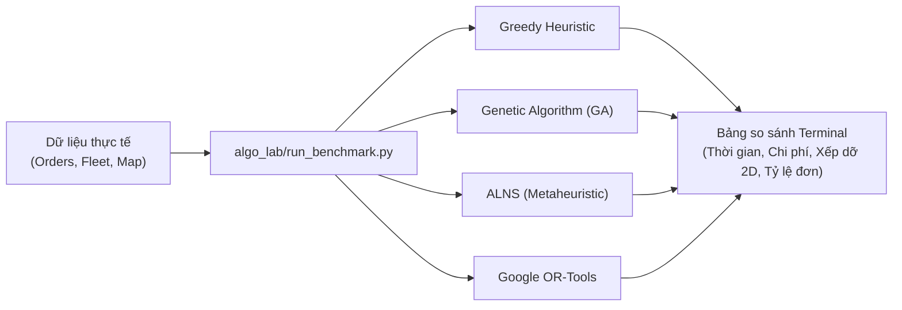

# TỔNG QUAN VỀ PHÒNG THỰC NGHIỆM THUẬT TOÁN (TMS ALGORITHM LAB)

Tài liệu này giải thích chi tiết và toàn diện 4 câu hỏi cốt lõi:
1. **Mục tiêu của thư mục `algo_lab/` là gì?**
2. **Đầu vào của thuật toán gồm những dữ liệu gì?**
3. **Mục tiêu tối ưu hóa là gì (Cần đạt được điều gì)?**
4. **Đầu ra của thuật toán gồm những kết quả gì?**

---

## 1. MỤC TIÊU CỦA THƯ MỤC `algo_lab/` LÀ GÌ?

Thư mục **`algo_lab/`** (Algorithm Laboratory) được tạo ra với vai trò là **một môi trường nghiên cứu và thực nghiệm độc lập (Sandbox)**:

* **Chạy 100% trong Terminal (CLI):** Không cần khởi động Frontend (React), không cần Backend (NestJS), không cần Database (PostgreSQL). Giúp nhà phát triển kiểm tra thuật toán ngay lập tức với tốc độ nhanh nhất.
* **Đấu trường so tài đa thuật toán:** Cho phép đặt các trường phái thuật toán khác nhau (Greedy Heuristic, Genetic Algorithm, ALNS, OR-Tools) lên cùng một bàn cân để so sánh trực tiếp trên cùng một bộ dữ liệu.
* **Tìm ra giải pháp "Vừa nhanh vừa tối ưu nhất":** 
  * Trả lời được câu hỏi thuật toán nào phản hồi trong 1-3 giây.
  * Thuật toán nào tiết kiệm chi phí xăng xe và nhân công nhất.
  * Thuật toán nào giải quyết triệt để vấn đề xếp hàng lên thùng xe ngoài đời thực.
* **Minh bạch hóa chi phí, loại bỏ "nghiệm ảo":** Ngăn chặn tình trạng thuật toán "ăn gian" (bỏ rơi đơn hàng hoặc nhồi nhét bất khả thi để báo chi phí 7 triệu rẻ tiền nhưng thực tế xe không thể chở và không thể dỡ hàng).



---

## 2. ĐẦU VÀO CỦA THUẬT TOÁN (INPUT DATA) LÀ GÌ?

Để giải bài toán tối ưu hóa đội xe, thuật toán cần được cung cấp 5 nhóm thông tin đầu vào sau:

### 2.1. Đội xe (Fleet Vehicles)
* **Kích thước lòng thùng xe:** Chiều dài ($L$), Chiều rộng ($W$), Chiều cao ($H$) tính bằng cm.
* **Tải trọng tối đa:** Khối lượng tối đa cho phép chở (ví dụ: $2,450$ kg, $5,500$ kg).
* **Vị trí xuất phát & kết thúc ca:** Tọa độ kho xuất bãi (Depot).
* **Đặc tính cửa xe:** Vị trí cửa (mặc định cửa đuôi xe - REAR door tại mép $X = L$).
* **Định mức tiêu hao & chi phí xe:**
  * Lít xăng cơ bản / 100 km (ví dụ: 12.5 lít/100km).
  * Phụ phí tiêu hao khi chở đầy tải trọng (ví dụ: tăng 20% khi full tải).
  * Chi phí cố định mở xe lăn bánh (ví dụ: 80,000đ – 120,000đ/ngày).

### 2.2. Đội ngũ tài xế (Drivers)
* **Bằng lái hợp lệ:** Hạng giấy phép lái xe (`B2`, `C`, `FC`...) tương thích với từng loại xe.
* **Chính sách lương & công:**
  * Lương cứng phân bổ theo thời gian làm việc thực tế của chuyến ($VND/\text{phút}$).
  * Phụ cấp theo mỗi km xe chạy ($VND/\text{km}$, ví dụ: 1,200đ/km).
  * Phụ cấp cuốc xe ($VND/\text{chuyến}$, ví dụ: 150,000đ/chuyến).

### 2.3. Danh sách Đơn hàng & Kiện hàng (Orders & Items)
Mỗi đơn hàng là một cặp điểm **Lấy hàng (Pickup) – Giao hàng (Delivery)**:
* **Điểm lấy hàng:** Địa chỉ, tọa độ (lat, lng), khung giờ cho phép lấy, thời gian bốc hàng.
* **Điểm giao hàng:** Địa chỉ, tọa độ (lat, lng), khung giờ cho phép giao, thời gian dỡ hàng.
* **Danh sách kiện hàng chi tiết (Cargo Items):**
  * Kích thước từng kiện: Dài $\times$ Rộng $\times$ Cao (cm).
  * Khối lượng từng kiện: Cân nặng (kg).
  * **Quy tắc xoay chiều:** **Tất cả các kiện hàng đều được phép xoay 90 độ** (hoán đổi chiều Dài và chiều Rộng trên mặt sàn xe) để tối ưu diện tích sàn và lối đi.
* **Giá trị đơn hàng & hạn cam kết:** Phục vụ việc tính phạt nếu giao trễ hạn.

### 2.4. Ma trận Khoảng cách và Thời gian (Distance & Duration Matrix)
Bảng số liệu $N \times N$ đo đạc thực tế theo mạng lưới giao thông đường bộ:
* $D(i, j)$: Khoảng cách di chuyển từ điểm $i$ đến điểm $j$ (tính bằng mét).
* $T(i, j)$: Thời gian di chuyển từ điểm $i$ đến điểm $j$ (tính bằng giây).

### 2.5. Chính sách chi phí (Cost Policy)
* Giá nhiên liệu thị trường ($VND/\text{lít}$).
* Chi phí lưu chuyển vốn hàng hóa trên đường ($VND/\text{tấn} \cdot \text{giờ}$).
* Mức phạt bỏ rơi đơn hàng (được đặt ở mức cao, ví dụ 10,000,000đ/đơn để ép thuật toán phải phục vụ hết đơn hàng).

---

## 3. MỤC TIÊU TỐI ƯU CỦA THUẬT TOÁN LÀ GÌ?

Mục tiêu của thuật toán là giải quyết bài toán đa mục tiêu phức tạp: **Đạt chi phí kinh tế thấp nhất nhưng phải thỏa mãn 100% các ràng buộc vật lý ngoài đời thực.**

### 3.1. Mục tiêu kinh tế (Hàm mục tiêu chi phí)
Tối thiểu hóa tổng chi phí vận hành toàn diện:

$$\min \quad \text{Tổng Chi Phí} = \text{Chi phí nhiên liệu} + \text{Khấu hao cố định xe} + \text{Lương tài xế} + \text{Chi phí giữ hàng} + \text{Phạt giao trễ} + \text{Phạt bỏ đơn}$$

Trong đó:
1. **Tiết kiệm xăng dầu:** Tìm lộ trình ngắn nhất và sắp xếp thứ tự lấy-giao thông minh để xe không phải chở nặng đi đường vòng (giảm phụ phí tải $kg \cdot km$).
2. **Tối ưu số lượng xe:** Dùng số xe ít nhất có thể mà vẫn đủ chở hết hàng.
3. **Tối đa hóa tỷ lệ giao hàng:** Giao được 100% đơn hàng của khách, không để rớt đơn nào.
4. **Đúng giờ:** Hạn chế tối đa việc vi phạm khung giờ hẹn của khách hàng.

### 3.2. Ràng buộc cứng bắt buộc phải tuân thủ (Hard Constraints)
Nếu thuật toán vi phạm bất kỳ điều nào dưới đây, phương án sẽ bị coi là **VÔ GIÁ TRỊ (FAIL)**:
1. **Lấy trước, Giao sau (Precedence):** Không thể giao hàng khi chưa đến điểm lấy hàng ($t_{pickup} < t_{delivery}$).
2. **Cùng một xe (Pairing):** Điểm lấy và điểm giao của cùng một đơn phải do cùng một xe thực hiện.
3. **Không quá tải (Weight Limit):** Tại bất kỳ thời điểm nào trên đường, tổng cân nặng hàng trên xe không được vượt quá tải trọng xe cho phép.
4. **Xếp dỡ 2D không chồng (Non-stackable):** Hàng xếp phẳng trên sàn xe, không đè lên nhau, nằm trọn trong kích thước thùng xe.
5. **Thông lối ra cửa (LIFO Door Clearance):** Cửa xe nằm ở đuôi thùng xe. Mỗi khi đến điểm giao hàng, kiện hàng cần dỡ **phải có một lối đi thông thoáng thẳng ra cửa xe** mà không bị các kiện hàng của đơn khác còn lại trên xe cản trở!

---

## 4. ĐẦU RA CỦA THUẬT TOÁN (OUTPUT DATA) LÀ GÌ?

Sau khi chạy xong, thuật toán trả về một bản kế hoạch điều vận chi tiết bao gồm:

### 4.1. Lộ trình chi tiết từng xe (Optimized Routes)
Với mỗi xe được điều động:
* **Phương tiện & Tài xế:** Biển số xe nào, tài xế nào lái.
* **Tổng chỉ số hành trình:** Tổng số km xe chạy, tổng số phút làm việc.
* **Bảng bóc tách chi phí lộ trình:**
  * Tiền xăng cơ bản + Tiền xăng tải nặng.
  * Lương cứng tài xế + Lương phụ cấp km + Phụ cấp cuốc.
  * Chi phí khấu hao xe.
  * Tiền phạt giao trễ (nếu có).
* **Chuỗi các điểm dừng theo thứ tự ghé thăm (Stops Sequence):**
  * Thứ tự 1, 2, 3...
  * Loại điểm: `PICKUP` (Lấy hàng) hay `DELIVERY` (Giao hàng).
  * Tên địa điểm & mã đơn hàng phục vụ.
  * Giờ đến dự kiến (ETA) và giờ rời đi (Departure time).
  * Khối lượng hàng trên xe ngay sau khi rời điểm đó.
  * Danh sách các kiện hàng được bốc lên hoặc dỡ xuống tại điểm đó.

### 4.2. Tọa độ xếp hàng trên sàn xe (Spatial Placement Plan)
Bản đồ vị trí 2D của từng kiện hàng trên mặt sàn thùng xe:
* Tọa độ $(X, Y)$ của từng kiện trong thùng xe.
* Hướng đặt (chiều dài, chiều rộng).
* Chứng minh trạng thái lối ra cửa xe: Đảm bảo khi đến lượt dỡ, kiện hàng không bị kiện khác chặn đường.

### 4.3. Danh sách đơn bị bỏ rơi (Unassigned Orders)
* Nếu có đơn không thể xếp (do thiếu xe, quá tải, hoặc nghẽn kích thước thùng xe), danh sách này liệt kê rõ mã đơn hàng và lý do kỹ thuật cụ thể.

### 4.4. Báo cáo hiệu năng thuật toán (Benchmark Metrics)
* **Thời gian thực thi (Execution time):** Thuật toán mất bao nhiêu giây/mili-giây để tính toán ra kết quả.
* **Tỷ lệ hoàn thành đơn (Fulfillment Rate):** Bao nhiêu % đơn hàng được phục vụ thành công.
* **Tính khả thi thực tế (Spatial Feasibility):** Đạt chuẩn xếp dỡ thực tế hay không (`PASS` hoặc `FAIL`).

---

## 5. TÓM TẮT SƠ ĐỒ ĐẦU VÀO - MỤC TIÊU - ĐẦU RA

```text
[ ĐẦU VÀO / INPUTS ]
 ├── Đội xe (Kích thước thùng, Tải trọng, Tiêu hao xăng, Khấu hao)
 ├── Tài xế (Bằng lái, Lương cứng, Phụ cấp km/chuyến)
 ├── Đơn hàng (Cặp Lấy-Giao, Khung giờ, Danh sách kiện hàng kích thước D x R x C, Cân nặng)
 ├── Bản đồ thực tế (Ma trận khoảng cách mét & thời gian giây)
 └── Chính sách giá (Giá xăng, Đơn giá giữ hàng, Mức phạt trễ/bỏ đơn)
            │
            ▼
[ THUẬT TOÁN & BỘ KIỂM TRA LIFO DOOR CLEARANCE ]
 (Greedy Insertion / Genetic Algorithm / ALNS / OR-Tools)
            │
            ▼
[ MỤC TIÊU TỐI ƯU / OBJECTIVE ]
 ├── Tối đa hóa đơn hàng phục vụ (100% đơn hàng)
 ├── Tối thiểu hóa chi phí (Xăng + Lương + Khấu hao + Phạt)
 └── Thỏa mãn 100% ràng buộc vật lý (Tải trọng, Khung giờ, Đường thông ra cửa)
            │
            ▼
[ ĐẦU RA / OUTPUTS ]
 ├── Kế hoạch lộ trình chi tiết từng xe (Thứ tự điểm dừng, Giờ đến/đi, Tải trọng từng chặng)
 ├── Sơ đồ bố trí kiện hàng trên sàn thùng xe (Tọa độ 2D, Lối ra cửa thông thoáng)
 ├── Bảng bóc tách chi phí minh bạch từng chuyến
 └── Chỉ số đo lường hiệu năng (Thời gian tính toán s, Tỷ lệ đơn %, Quãng đường km)
```
